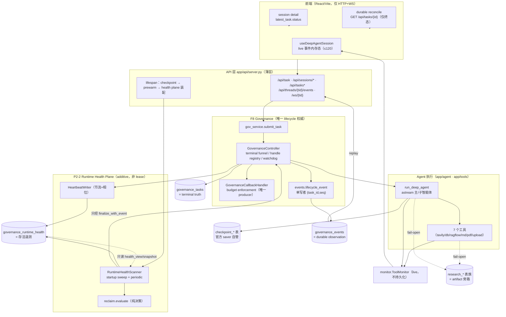

# P3_RUNTIME_OBSERVABILITY_DISCOVERY_REPORT

**Agent Runtime Observability — Discovery & Planning（L0 只读审计 + 规划）**

- 报告日期：2026-10（本会话）
- 任务分类：**L0 Read-only / Analysis**（PROCESS.md §11.1）——本报告为**只读分析 + 规划产物**；**未修改任何代码 / 未建表 / 未加依赖 / 未接入 LangSmith / 未新建 branch / 未 commit**
- 审计基线：`main` @ `8d9531d`（Merge `feature/runtime-p2-2-heartbeat-stale-reclaim` ← `884a681`，即用户指定的 P2-2 commit；本地工作树另有**不属于本任务**的未提交文件，见 §0.4）
- 审计范围：`app/runtime/**`、`app/api/**`、`app/session/**`、`app/agent/**`、`app/tools/**`、`app/research/registry.py`、`db/governance_migrations/**`、`frontend/src/**`、`tests/**`（仅列名与相关用例）、`DECISION.md`、`P2-*.md`、`docs/plan/2026-10-03-*`
- 目标一句话：**不构建 LangSmith 替代品**；让「每一个 DeepSearch 任务正在做什么」成为**可查询、可展示、可管理**的 Runtime State Plane 事实。

---

## 0. 前置声明（治理 / 冲突 / 证据）

### 0.1 使命与边界（用户指令 + Harness 约束）

| 项 | 内容 |
|---|---|
| 用户最终目标 | 「我现在知道每一个 DeepSearch 任务正在做什么，并且用户和管理员都能看到。」 |
| 本阶段禁止 | 修改代码 / 新建数据库表 / 新增依赖 / 接入 LangSmith；只做 repository analysis + architecture review + implementation planning |
| 职责划分（用户） | Runtime Console = 当前任务/Agent/Tool 状态、用户进度、管理控制；LangSmith = LLM trace / Prompt / Token / Cost / Evaluation；二者经 `trace_id` 关联 |
| 仓库红线（继承） | F8 Controller 是**唯一** lifecycle/budget/deadline/cancel/terminal 权威；`TaskRecord` = terminal truth；event = observation（fail-open，不驱动状态）；三平面（checkpoint / TaskRecord+GovernanceEvent / ResearchRun）永不混淆；不新增第二 Runtime 控制面 |

### 0.2 必须显式报告的冲突（AGENTS.md §1：不静默裁决）

| # | 冲突 | 冲突双方 | 本报告处理 |
|---|---|---|---|
| C1 | **阶段命名** | 用户称本轮为 **P3**；仓库既有路线图把同一能力域命名为 **P2-3**（durable timeline / transcript）、**P2-4**（admin runtime 端点）、**P2-5**（session 标题） | **报告冲突，不静默改名**。用户请求优先（AGENTS §1.1）。本报告保留用户 **P3** 命名，并在 §5 给出与 P2-3/P2-4 的**逐项映射**；正式立项时需用户裁决采用哪套编号（见 §7 Q1） |
| C2 | **L0 是否允许产出 Implementation Plan** | PROCESS.md §11.1/§11.4：L0「不产 Implementation Plan，禁止实现」；用户本次**显式要求**输出 §5 Implementation Plan | 用户请求优先（AGENTS §1.1）。处理方式：§5 定位为**规划性 Roadmap（Planning Design）**，不是 L3 正式 Implementation Plan；正式 Plan 必须在后续独立任务中按 L2/L3 流程重新产出（Spec → Readiness → Decision Closure → Plan → Plan Review） |
| C3 | **PROJECT_CONTEXT.md 与真实仓库状态不一致** | `PROJECT_CONTEXT.md` §1/§9/§11 仍记录「F9-P0 COMPLETE → Documentation/Presentation 阶段；禁止修改 F9 runtime」；实际 `main` 已推进到 P2-1（`dd7af9a`）、semantic module layout（`a0585ac`）、multi-session（`2dca2ee`）、P2-2（`884a681`/`8d9531d`） | **报告不一致，不在本任务修正**（修正属 L1 文档变更，且 PROJECT_CONTEXT §12 要求与权威文档一致后由用户 Review）。**推论：本报告未以 PROJECT_CONTEXT 作为状态依据**，一切结论以实际代码 + `git log` + `DECISION.md`/P2-* 文档为准 |
| C4 | **工作树含非本任务改动** | `git status`：`M 简历项目经历-深度研搜.md`、未跟踪 `P2-1_INTEGRATION_READINESS_REPORT.md`、`P2-1_MERGE_REPORT.md`、`P2-2_RELEASE_GATE_AUDIT_REPORT.md`、`简历-AI应用开发-Agent方向.html` | 按 AGENTS.md §10.5（Mixed/Unowned Working Tree）：**STOP → report → wait**。本任务**未触碰上述任何文件**，仅新增本报告文件；**未执行任何 git 写操作**（§0.4） |
| C5 | **L0 中结论指向「需要修改」** | PROCESS.md §11.3：L0 结论若转为「需修改」→ 重新按 §11.1 分类立项（≥ L1），不得在 L0 内改码 | 本报告结论确实指向实现，但**不做任何实现**；§5 仅给出 Roadmap，§6 给出立项入口（L3 流程） |

### 0.3 已读证据清单（读了什么 / 为什么读）

| 文件 | 为什么读 | 关键结论 |
|---|---|---|
| `app/runtime/governance/models.py` | Task 状态模型权威 | `TaskStatus` = `running` + 8 终态；无 queued/STALE；`TaskRecord` / `GovernanceEvent` 字段与 JSON 归一 |
| `app/runtime/governance/events.py` | 事件契约与 sequencer | 单写者 `(task_id, seq)` 全序；`event_type` 白名单 = lifecycle only；PK 幂等；fail-open + `durability_gap`；`replay_events()` cursor（task-scoped） |
| `app/runtime/governance/store.py` | 持久化纪律 | sqlite/PG 双后端；`%s` 参数化；`terminal_update` CAS `WHERE status='running' AND version=?`；`update_run_id` 仅 running+NULL 回填 |
| `app/runtime/governance/controller.py` | lifecycle 唯一写者 | `terminalize` funnel（内存裁决 + retry → pending）；`finalize_with_event` = funnel + durable terminal event + live bridge；`_execute_governed` = BudgetCounter + watchdog + ContextVar + 首拍心跳；`_execute_bare`（policy=None）无 watchdog/无事件；`flush_pending` 定义存在，**无生产调用方** |
| `app/runtime/governance/service.py` | 提交接线 | `submit_task`：`normalize_policy` → `create_task` → durable `task_started`（**在受理时刻**）→ `asyncio.create_task(execute(policy))` |
| `app/runtime/governance/policy.py` | 默认 policy 单一来源 | P2-1：`policy=None` ⇒ 注入 `DEFAULT_GOVERNED_POLICY`（生产恒 governed）；非法 policy fail-closed |
| `app/runtime/governance/callbacks.py` | 唯一 budget producer | 仅 `on_llm_start` / `on_tool_start`（enforcement 计数）/ `on_llm_end`（observation-only）；**无 `on_tool_end` / `on_tool_error` / `on_chain_*`**；不产生任何观察事件 |
| `app/runtime/governance/counters.py` | 预算计数 | 四 hard counter 进程内线程安全；`snapshot()` 仅在 terminal 落库 |
| `app/runtime/governance/context.py` | 执行上下文注入 | `GovernanceExecution(task_id, run_id, counter, recursion_limit)` 经 ContextVar 传递；`make_handler()` 单例 |
| `app/runtime/governance/heartbeat.py` | **P2-2 复用评估** | `HeartbeatWriter`：per-task 节流 + 确定性相位（sha256）+ fail-open + 可注入 clock |
| `app/runtime/governance/health_store.py` | **P2-2 复用评估** | 独立 health 表读写；`list_running_tasks()` 只读候选；`list_cleanup_candidates()` LEFT JOIN 单查询；明确禁止触碰 lifecycle 字段 |
| `app/runtime/governance/scanner.py` | **P2-2 复用评估** | `startup_sweep`/`scan_once`/`start_periodic`/`stop`/`cleanup_health_rows`；**`health_view()`/`health_snapshot()` 只读派生视图，注释明文「供 P2-4 后续消费；本阶段不暴露端点」** |
| `app/runtime/governance/reclaim.py` | stale 判定复用 | 纯决策逻辑（可注入 clock）；`liveness_evidence` / `deadline_evidence` / `classify_owner`；`ReclaimConfig.from_env()` 单一配置源；模式 `off`/`detect`/`enforce` |
| `app/runtime/governance/migrations.py` | 迁移纪律 | versioned + idempotent；`db/governance_migrations/NNNN_*.{dialect}.sql` |
| `db/governance_migrations/0001_governance.sqlite.sql` | 表结构 | `governance_tasks`（18 列，无 heartbeat/last_seen）+ `governance_events`（`UNIQUE(task_id, seq)`）；无 FK 到 checkpoint/research |
| `db/governance_migrations/0003_runtime_health.sqlite.sql` | P2-2 表 | `governance_runtime_health`（task_id PK / thread_id / run_id / owner_instance / last_heartbeat_at / beat_count / created_at / updated_at） |
| `app/api/server.py` | API / WS / lifespan 接线 | `_start_runtime_health()` 装配 writer+scanner+sweep（yield 前）；`live_sink` 桥；端点族：task/cancel/tasks/sessions/replay/upload/files/ws；**无 admin runtime 端点** |
| `app/api/monitor.py` | live 事件信封 | R3 envelope（event_id/run_id/thread_id/task_id/seq）+ per-thread 串行队列；**不持久化**；`RunTerminalGuard` 终态恰一次；**只有 `report_tool`（start），无 tool_end/tool_error** |
| `app/agent/main_agent.py` | Agent 执行边界 | `run_deep_agent` = 唯一 agent 入口；governance-active 时注入 `GovernanceCallbackHandler` + `recursion_limit`；astream 循环内 live `report_assistant`（`tool_call.name == "task"`）；异常在 governance 下 re-raise；`finally` 只 reset ContextVar |
| `app/tools/*.py`（7 个工具） | Tool 调用埋点 | 全部仅 `monitor.report_tool(...)`（live、无时长、无完成/失败）；`tavily/db/ragflow` 另写 research artifacts（旁路 fail-open） |
| `app/session/service.py` | Session/Runtime 归属 | session = 容器；task 聚合（`task_count`/`running_tasks`/`latest_task`）；`query` 由 research 面 enrich |
| `app/research/registry.py` | 既有 durable run 状态 | `research_runs.status`（`running` → `finished`/`failed`/`cancelled`）+ `started_at`/`finished_at`；`set_run_status` 为 run 级唯一状态写入口（research 面） |
| `frontend/src/lib/taskStatus.ts` | 用户可见标签 | 9 个 status → 中文短标签（`running`=「研搜中」…） |
| `frontend/src/hooks/useDeepAgentSession.ts` | 用户侧状态恢复 | 仅消费 `monitor_event`；**显式丢弃 `governance_replay`/`governance_error` 帧**；`MAX_EVENTS=120` 内存态；durable reconcile 仅查**终态**（`GET /api/tasks/{id}`，20×250ms）；刷新恢复走 `latest_task.status` |
| `frontend/src/components/ConversationThread.tsx` | 用户可见进度 | 只有「生成中 · 思考 mm:ss」或「已同步/已取消 · 用时」；`error` 仅在 `failed` 分支展示（L311-314）；`endedNoticeText` 覆盖 8 终态文案 |
| `frontend/src/components/StatusStrip.tsx` / `EventStream.tsx` | 前端统计/轨迹 | 统计 = live 事件计数；轨迹 = live 事件列表（刷新即空） |
| `tests/`（列名 + 相关用例） | 复用/回归基线 | `test_runtime_heartbeat.py`、`test_runtime_scanner.py`、`test_runtime_reclaim.py`、`test_runtime_health_postgres.py`、`test_runtime_server_lifespan.py`、`test_agent_events.py`、`test_runtime_governance_step4_batch1/2/3.py` 等已锁定现有语义 |
| `RUNTIME_OBSERVABILITY_AUDIT_REPORT.md` | **先前同域 L0 审计（必须不重复造）** | 已给出 Phase-2 方案（P2-1…P2-5）与根因；本报告在其之上做**实现现状复核 + P3 规划**，不推翻其结论 |
| `P2-2_SPEC_v2.md` Rev 2.2 / `P2-2_IMPLEMENTATION_PLAN.md` / `P2-2_RELEASE_GATE_AUDIT_REPORT.md` | P2-2 冻结契约与 Non-Goals | P2-2 明确 Non-Goals：P2-3 timeline / P2-4 admin 端点 / 新 HTTP·WS 端点 / 新 TaskStatus / 连接池 / frontend |
| `DECISION.md`（D-Phase2-P2-1-001、D-Phase2-P2-2-001…017） | 冻结决策 | health plane 非 lease；stale 为派生态；reclaim 只走 funnel；诊断载体 = `error` 字符串（**payload 扩展留 P2-4**）；frontend 零改动 |
| `docs/plan/2026-10-03-multi-session-*.md` | 多会话取舍 | 隔离/归属语义；标题默认「未命名会话」；后续 additive 项 |

> 未读（按 AGENTS §3 Document Loading Policy 明确排除）：历史 `docs/plan/*`（F9 Batch1–8 报告）、F1–F7 specs、`docs/problem/` 明细（确认 P001–P007 摘要即可，本任务不触安全敏感改动）、`docs/interview/*`。

### 0.4 本任务未做任何写操作（证据）

- 未修改任何已有文件；仅**新增**本报告 `P3_RUNTIME_OBSERVABILITY_DISCOVERY_REPORT.md`。
- 未执行任何 git 写操作（无 `add` / `commit` / `push` / `branch` / `merge` / `reset` / `stash`）。
- 未新增表 / 迁移 / 依赖（`requirements.txt`、`pyproject.toml`、`db/**` 零改动）。
- 未接入 LangSmith（全仓库 `langsmith|LANGSMITH|LANGCHAIN_TRACING|trace_id` 关键词扫描：**0 命中**，见 §4.5）。

---

## 1. Current Architecture（当前 runtime 架构）

### 1.1 平面拓扑（现状，含持久化载体）



### 1.2 一次生产任务的完整链路（现状）

```text
POST /api/sessions/{sid}/tasks  或  POST /api/task
  → _require_governance()                          fail-closed（store 不可用 → 503）
  → _start_governed_task()                         同 thread 旧任务 cancel/supersede 收敛
  → gov_service.submit_task()
       normalize_policy()                          P2-1：None ⇒ DEFAULT_GOVERNED_POLICY
       controller.create_task()                    INSERT governance_tasks(status=running)  ← 无 TASK_CREATED 事件
       events.lifecycle_event(status="running")    durable event_type=task_started（**受理时刻**）
       asyncio.create_task(controller.execute(task_id, run_deep_agent(query, sid), policy))
  → controller._execute_governed()
       run_id 前绑定/回填（仅 running 且 NULL）      F1 Run Identity Contract
       BudgetCounter(policy limits) + GovernanceExecution ContextVar
       start_task() → started_at
       enter_governance_execution(ctx)
         handle 注册 → heartbeat 首拍（force=True）  D-Phase2-P2-2-004
         watchdog task（1s tick；deadline = start + wall_clock）
  → run_deep_agent()
       session_dir / uploads 复制 / ContextVar / ResearchRun(root)
       config.callbacks += GovernanceCallbackHandler；recursion_limit 注入
       monitor.report_task_started（live）
       agent.astream(...)                           主 agent → 子 agent（tool name == "task"）→ 工具
       （工具内 monitor.report_tool；tavily/db/ragflow 另写 research artifacts）
       astream 结束 → F7 finalize_run（fail-open）→ monitor.report_task_result（live，恰一次）
  → controller 收敛：finalize_with_event(reason)
       terminalize() 内存裁决 → 取消底层 handle → 乐观 CAS terminal_update（rowcount==1）
       events.lifecycle_event(status=终态)          durable task_completed / task_failed / ...
       live_sink → {"type":"governance_terminal", ...}（observation bridge）
  → 前端：task_result/error/cancelled（live）→ doReconcile() → GET /api/tasks/{id}（**仅终态**）
```

旁路（与主链路解耦）：
- **P2-2 health plane**：`HeartbeatWriter.beat()`（首拍 + watchdog 每 tick，节流 + 确定性相位）→ `governance_runtime_health`；`RuntimeHealthScanner`（startup 有界 sweep + 15s±20% periodic）→ `reclaim.evaluate()` → 只经 `finalize_with_event` 收敛（`aborted` / `orphan_reclaimed`）+ 清理 health 行。
- **research plane**：`research_runs` / `sub_questions` / `search_queries` / `sources` / `evidence` + F2–F6 artifacts（fail-open，与 checkpoint / governance 不共表）。

### 1.3 身份与关联键（现状）

| 键 | 平面 | 现状 | 可用于 Runtime Observability？ |
|---|---|---|---|
| `thread_id` | UI/会话 | `session_id == thread_id`（1:1）；安全字符集 | ✅ 用户侧/管理侧聚合主键 |
| `task_id` | governance | TaskRecord PK；WS 事件信封已带（Batch 3 C，governed 才有） | ✅ 用户侧/管理侧主键 |
| `run_id` | 执行相关键 | F1 绑定：TaskRecord.run_id == GovernanceExecution.run_id == `run_deep_agent` ctx run_id == ResearchRun.run_id == monitor 信封 run_id | ✅ **当前唯一跨三平面的关联键** |
| `monitor.event_id` / `seq` | live | 进程内 uuid + 全局单调；**不持久化** | ⚠ 仅 live 去重/排序 |
| `governance_seq` | durable | task-scoped 全序（`UNIQUE(task_id,seq)`） | ✅ durable replay cursor |
| LangSmith run/trace | 无 | **不存在**（0 命中） | ❌ 需 P3-5 新建，且必须 additive |

> **文档漂移（证据）**：`frontend/src/hooks/useDeepAgentSession.ts:213-214` 注释仍称「monitor 信封 run_id（main_agent 本地生成）≠ governance TaskRecord.run_id」。P2-1 之后 `main_agent.py:142-147` 优先沿用 `gov_exec.run_id`、`service.submit_task` 预生成并回填，二者**同源**。该注释为**过时描述**，建议后续单独小批修正（§6.3 建议 Candidate）。

---

## 2. Existing Capability（已有能力盘点）

> 判定口径：**可复用** = 不改其冻结语义即可作为 P3 Runtime State Plane 的输入/载体；**部分可复用** = 需 additive 扩展或需新增契约；**不可复用** = 语义不匹配或与冻结边界冲突。

| 能力 | 位置（文件:行，基线 8d9531d） | 是否可复用 | 依据 / 现状细节 |
|---|---|---|---|
| **Task lifecycle（durable 权威）** | `governance/models.py:15-40`（TaskStatus）、`store.py:233-356`（insert/get/start/update_run_id/terminal CAS）、`controller.py:250-331`（funnel） | ✅ **完全可复用（唯一权威）** | `running` + 8 终态；CAS `WHERE status='running' AND version=?` 恰一次；`pending_terminal` + `degraded_durability` 显式暴露降级 |
| Task 创建事件 | `controller.create_task()`（无 event） | ❌ 不存在 | **无 `TASK_CREATED` 事件**；创建事实仅体现在 `governance_tasks` 行 + `created_at` |
| Task started 事件 | `service.py:75-83`（`lifecycle_event(status="running")` → `task_started`） | ⚠ 部分可复用 | 存在，但**语义 = 「已受理」**（submit 时刻），非「开始执行」；真实执行起点是 `started_at`（`controller.py:623`）与心跳首拍 |
| Task completed / failed 事件 | `events.py:29-39` 白名单 + `controller.py:392-445`（`_publish_terminal_event`） | ✅ 可复用 | `task_completed` / `task_failed`（含 `error_kind`：agent_failure / governance_control_failure / framework_recursion_safety）；另有 `task_cancelled`/`task_timed_out`/`task_budget_exceeded`/`task_aborted`/`task_superseded`/`task_orphan_reclaimed` |
| Task 事件顺序与回放 | `events.py:174-227`（`replay_events`，task-scoped cursor）+ `server.py:595-615`（REST）+ `server.py:801-842`（WS since_seq） | ✅ **可复用（且前端当前未消费）** | `(task_id, seq)` 全序、单写者、PK 幂等、gap 仅同 task 检测；`limit` 默认 200 / 上限 1000；**前端显式丢弃 `governance_replay` 帧**（`useDeepAgentSession.ts:202-205`）→ 零成本即可点亮「刷新后可回放」能力 |
| **Heartbeat（存活遥测）** | `heartbeat.py:133-241`（`HeartbeatWriter`）、`health_store.py:92-123`（UPSERT）、`db/governance_migrations/0003_*` | ✅ **直接可复用** | per-task 节流（默认 5s ± 20% 确定性相位）+ `force=True` 首拍 + fail-open + 可注入 `monotonic_fn`/`utcnow_fn`；`beat_count` 可用于诊断「跨进程/重启」；**非 lease/fencing**（D-Phase2-P2-2-001） |
| Heartbeat 写点接线 | `controller.py:638-640`（首拍）、`controller.py:719-721`（watchdog tick）、`controller.py:824-865`（`_beat`/`_forget_beat`）、`server.py:61-97`（装配） | ⚠ 部分可复用 | **心跳节拍依赖 watchdog 循环存在**（`timeout > 0` 才创建）；`policy` 校验强制 `wall_clock_timeout > 0` ⇒ 生产恒有；但「心跳 = 有 watchdog」是隐含耦合，P3 若要做「无进展」判定需明确 |
| **Stale 判定 / 证据谓词** | `reclaim.py:298+`（`liveness_evidence`/`deadline_evidence`）、`:104-188`（`ReclaimConfig.from_env`）、`:239-268`（`classify_owner`） | ✅ **可复用为只读派生** | 纯函数、可注入 clock、`off`/`detect`/`enforce` 三模式；`liveness_threshold = max(3×interval, 15s)`；`SAME_HOST_PREV` 必须叠加 liveness 证据（D15） |
| **Health 只读派生视图（为 admin 预留的缝）** | `scanner.py:312-355`（`health_view()` / `health_snapshot()`） | ✅ **P3 直接复用（设计即为此预留）** | 返回 `{status, health: healthy\|stale\|expired, last_heartbeat_at, beat_count, owner_instance}`；注释明文「供 P2-4 后续消费；本阶段不暴露端点」；当前**无任何 HTTP 端点** |
| Health 行清理 | `scanner.py:298-309` + `health_store.py:180-206` | ✅ 可复用 | 终态/孤儿行删除；**清理滞后 ≤ 1 扫描周期** ⇒ 投影必须容忍「无 health 行」 |
| 扫描编排 | `scanner.py:114-190`（periodic/单飞/fail-open/stats） | ⚠ 部分可复用 | 判定不在此层（唯一经 `reclaim.evaluate`）；`ScanStats` 仅日志，**未持久化**；`_stale_counts`（确认次数）为**进程内** |
| **Event 体系（live）** | `app/api/monitor.py:111-236`（`ToolMonitor`）+ `:239-346`（`ConnectionManager`） | ⚠ 部分可复用 | R3 envelope 完整（event_id/run_id/thread_id/task_id/seq/timestamp/data）；per-thread 串行队列、跨线程安全、fail-open；**不持久化**；`MAX_EVENTS` 由前端限制为 120；`_emit` 中 `print` 为唯一「日志」 |
| Event 体系（durable） | `events.py`（单写者 + sequencer）+ `governance_events` 表 | ✅ **可复用（推荐作为唯一 durable event 载体）** | 已有 `(task_id, seq)` 全序、PK 幂等、replay cursor、`durable` 标记、fail-open + `durability_gap`；**但 `event_type` 白名单 = lifecycle only**，扩展需专业决策（D-Phase2-P2-2-008 明确 payload 扩展留 P2-4） |
| 终态恰一次守卫 | `monitor.py:84-108`（`RunTerminalGuard`） | ✅ 可复用 | run 级终态（task_result/task_cancelled/error）至多一次 |
| governance→WS 桥 | `controller.py:424-445` + `server.py:168-178`（`_governance_terminal_sink`） | ⚠ 部分可复用 | 仅 terminal 一帧；`event_id` 与 durable 对齐；`live_sink` DI 模式（与 `heartbeat_writer` 同款）是 P3 新增 live 帧的**现成注入点** |
| **Agent 状态** | `main_agent.py:97-275`（execution）、`:213-226`（`report_assistant`）、`research/registry.py:86-137`（run status） | ❌ **基本不存在** | 无 agent start/finish hook、无 agent status、无 per-subagent 生命周期；仅 ① live `assistant_call`（子智能体调度，**只有 start**）；② research 面 run 级 `running→finished/failed/cancelled`（非 agent 粒度、无中间态、不属 runtime 平面） |
| **Tool 状态** | `monitor.report_tool`（7 处）、`callbacks.py:151-169`（`on_tool_start` 仅计数） | ❌ **仅 start，无完成/失败/时长** | 只有 `tool_start`（live、无 event 关联 id、无 duration）；工具失败 = 返回错误字符串或抛异常；**无 `tool_end` / `tool_error`**；research artifacts（`record_search_query` + sources/evidence）仅覆盖 tavily/db/ragflow，**md/pdf/upload 无 artifact** |
| 预算计数（可展示的「进度」素材） | `counters.py:64-165` + `controller.py:588`（每 execution 一个实例） | ⚠ 部分可复用（需只读暴露） | 四 counter 实时准确（llm_calls/tool_calls/search_calls/agent_steps）；**仅在 terminal 经 `counters_snapshot` 落库**，执行中无任何读取入口 |
| Runtime 只读查询（现状） | `controller.py:789-819`（`pending_snapshot`/`terminal_decision`/`lifecycle`）、`store.py:275-290`（`list_tasks`） | ✅ 可复用 | `lifecycle()` 已给出「record + memory_terminal + degraded_durability + pending_terminal + store_readable」合并视图（供后续 API，当前未接线 HTTP） |
| 管理侧聚合端点 | — | ❌ **不存在** | 无「运行中任务列表」「stale 列表」「health 查询」「全程未读游标」端点；只有 per-task / per-thread 查询 |
| 结构化日志 / 指标 | `print(...)`（server/controller/scanner/monitor） | ❌ 不可复用 | 无 logger 配置输出目标、无 trace、无 metrics；诊断依赖 stdout + DB |
| 依赖注入模式（扩展现有机制的模板） | `controller.live_sink`（`server.py:188-189`）、`controller.heartbeat_writer`（`server.py:85-88`）、`scanner(controller, config=...)` | ✅ 可复用 | **P3 新组件应沿用同款「server 装配注入 / 组件不依赖 server」模式**，避免 server 膨胀 |

---

## 3. Gap Analysis（缺口分析）

> 缺口按用户提出的四类组织；每条给出「现状证据 → 缺失项 → 影响」。

### 3.1 Runtime Event（缺口：无统一的、可持久化的运行时事件流）

| 缺口 | 证据 | 影响 |
|---|---|---|
| G1. 只有 lifecycle 事件是 durable；agent/tool/step/LLM 事件**全部 live-only** | `events.py:29-39` 白名单；`monitor.py:134-185` 无 DB 写 | 断线 / 刷新 / 事后复盘**无法还原时间线**；「卡在哪一步」不可回答 |
| G2. live 与 durable 两套信封**不共享事件契约**（无统一 event_type 词表、无统一 status/phase 语义） | `monitor.py:154-165`（monitor_event）vs `events.py:69-81`（payload 仅 status/terminal_reason/error/counters） | 同一事实在两处语义漂移；前端需要两套解析逻辑；无法引用单一契约 |
| G3. 无 `TOOL_CALL_STARTED/COMPLETED/FAILED` 三段式与 `duration` | `monitor.report_tool` 仅 start；`callbacks.py` 无 `on_tool_end`/`on_tool_error`；无计时 | 「当前调用哪个 tool / 是否卡在某个 tool」**不可判定**；工具耗时/失败率无数据 |
| G4. 无 agent / subagent 生命周期事件（start / finish / status） | `main_agent.py:213-226` 仅 report_assistant(start)；无 `report_assistant_end` | 「当前正在运行哪个 Agent」**只能靠 live 事件最后一条猜测**，且不可回放 |
| G5. 无 `TASK_CREATED`；`task_started` 语义 = 受理而非执行开始 | `controller.create_task` 无 event；`service.py:75-83` | 「受理 → 真正开始执行」之间的排队/组装延迟不可观测；`created_at` vs `started_at` 语义未在事件面暴露 |
| G6. 无 `trace_id` / 跨平面关联字段（LangSmith 关联位缺失） | 全仓库 0 命中 `trace_id`；仅 `run_id` 可关联 | 无法与 LLM trace 平面关联；P3-5 必须先定关联键 |
| G7. 事件「可达性」不可观测：`durability_gap` 已回传但**无处消费** | `events.py:134-155` 返回 `durability_gap`；`controller._publish_terminal_event` 忽略返回值（仅 live 帧取 `event_id`） | 事件缺失无法被管理侧发现（观测面自身不可观测） |

### 3.2 State Projection（缺口：无「当前状态」投影）

| 缺口 | 证据 | 影响 |
|---|---|---|
| G8. 无 task 级「当前阶段/当前 agent/当前 tool/最后活动时间」投影 | `TaskRecord` 仅 `status` + terminal 字段；执行中间态只在内存（handle / BudgetCounter / ContextVar） | 用户与管理侧都**看不到过程**；「是否卡住」只能靠 30 分钟无事件主观判断 |
| G9. 实时计数器无读取入口（只在 terminal 落库） | `counters.py:95-98`（`snapshot()`）仅在 `controller.py:618/726` 用于收敛 | 无「已用 X/120 LLM 调用」类进度；预算将耗尽不可提前预警 |
| G10. heartbeat / stale 派生视图**已实现但无出口** | `scanner.py:312-355`（设计即为 P2-4 预留），无端点 | 已完成的能力被闲置；健康数据只能经日志看到 |
| G11. 无跨 task 的运行时「聚合」投影（current running / stale / 按 owner / 按 session） | `health_store.list_running_tasks` 仅供 scanner 内部使用 | 管理侧无法回答「现在系统里有几个任务在跑、几个卡住」 |
| G12. health 行在任务终态后被清理、`_stale_counts` 为进程内 | `scanner.py:298-309`、`:219-236` | 投影必须容忍无 health 行（回退 `started_at/created_at`）且不能依赖确认次数持久化 |

### 3.3 User Progress（缺口：用户只能看到「生成中 / 已完成」）

| 缺口 | 证据 | 影响 |
|---|---|---|
| G13. 用户可见进度 = 一个转圈 + 时长 + live 事件条数；无阶段/agent/tool 语义 | `ConversationThread.tsx:364-370`（`生成中 · 思考 mm:ss`）、`:279-304`（ThinkingLoader「理解问题/调度工具/汇总答案」为**静态文案**，非真实阶段） | 用户无法判断「在跑还是在卡」；静态阶段文案有**误导风险**（与实际执行脱节） |
| G14. 刷新 / 切会话后过程态丢失（live 不持久化，turns 在浏览器内存） | `useDeepAgentSession.ts:25`（MAX_EVENTS=120）、`:224`（内存 events）；session 切换组件卸载 | 历史会话只剩终态摘要；「切换会话后无法恢复详细执行状态」正是该缺口 |
| G15. durable replay **已存在但前端主动丢弃** | `useDeepAgentSession.ts:202-205` 忽略 `governance_replay` | 现成能力未用；点亮它即可获得「刷新后至少可回放 lifecycle 骨架」 |
| G16. 失败原因展示不全（仅 `failed` 显示 `error`） | `ConversationThread.tsx:311-314`；D-Phase2-P2-2-017 记为后续项 | `timed_out` / `budget_exceeded` / `aborted` / `orphan_reclaimed` / `superseded` **无原因文本**；reclaim 诊断（`error` 字符串）不可见 |
| G17. 用户无「停止/控制」以外的任何管理信息（无进度百分比、无预估剩余、无当前子任务） | 无对应数据源 | 「不可诊断」即用户体验问题（用户无法决定是否继续等待） |

### 3.4 Admin Console（缺口：管理侧无聚合视图）

| 缺口 | 证据 | 影响 |
|---|---|---|
| G18. 无 admin/runtime 端点族 | `server.py` 全部 17 个端点（`/api/task`、`/api/task/{tid}/cancel`、`/api/tasks`、`/api/tasks/{task_id}`、`/api/sessions` POST/GET、`/api/sessions/{id}` GET/DELETE/PATCH、`/api/sessions/{id}/tasks` POST/GET、`/api/sessions/{id}/tasks/{task_id}/cancel`、`/api/threads/{tid}/events`、`/api/upload`、`/api/download`、`/api/files`、`/ws/{thread_id}`）中**无任何 admin/runtime 聚合端点** | 只能逐个 `task_id` 或逐个 thread 查；无法一览全局运行态 |
| G19. 无「运行中任务 + 最后 heartbeat + 最后事件 + 当前 error」的单一视图（P2-4 原定目标） | `lifecycle()` 有部分数据但未接线；无 last_event_at | 控制台无法替代「人工翻日志」 |
| G20. stale / reclaim 结果只进日志与终态 `error` 字符串 | `scanner.py:279-286`（logger.info）、`:288-295`（`error` 载诊断） | 管理侧看不到「哪些任务被判 stale、为何、阈值多少」 |
| G21. 无可观测性缺口自检（event durability_gap、heartbeat 写失败计数、scan stats） | `heartbeat.py:161-163`（`write_failures`）、`scanner.py:47-64`（`ScanStats`）均**仅进程内**、无出口 | 「观测面自身故障」不可见 → 静默失明风险 |
| G22. 无鉴权边界（P005 Won't Fix，教学边界） | `docs/problem/P005`；`server.py:202-208`（CORS `*`） | **新增只读端点会新增信息暴露面**（可读他人 task/query/error）。P3 必须先做显式决策（§7 Q4），默认 fail-closed（如仅 localhost / env 开关） |

### 3.5 结论（缺口与用户四个诉求的映射）

| 用户诉求 | 对应缺口 | 是否已有基础 |
|---|---|---|
| 当前任务执行阶段 | G8 G13 | ⚠ 需新建投影；素材（status/counters/heartbeat/事件）齐备 |
| 当前正在运行哪个 Agent | G4 | ❌ 需新增 agent 事件（live + durable） |
| 当前调用哪个 Tool | G3 | ⚠ 已有 start，缺 end/failed/duration 与关联 id |
| 是否卡住 | G8 G10 G11 G12 | ✅ **P2-2 已具备判定能力，仅缺出口** |
| 失败原因 | G16 G20 | ⚠ 数据已有（`error`/`error_kind`/`terminal_reason`），缺展示与覆盖全终态 |
| 切换会话后恢复详细状态 | G1 G2 G14 G15 | ⚠ durable 载体与 replay 端点已有，缺非 lifecycle 事件持久化 + 前端消费 |
| 管理侧聚合（运行中/stale/health） | G11 G18 G19 G20 G21 | ✅ 判定与视图函数已有（`health_view`/`health_snapshot`/`lifecycle`），缺 API 与 console |

---

## 4. Recommended Architecture（设计，不编码）

### 4.0 设计原则（硬约束）

1. **不建第二控制面**：F8 Controller 仍是唯一 lifecycle/budget/deadline/cancel/terminal 权威；State Plane 只**读**。
2. **不新增 TaskStatus**：`stale` / `healthy` / `expired` 保持**派生态**（D-Phase2-P2-2-001）。
3. **两套账本纪律不变**：`TaskRecord` = terminal truth；`GovernanceEvent` = durable observation（fail-open，可缺失、可延迟，绝不驱动状态）。
4. **三平面不混淆**：checkpoint / governance / research（+ 新增的 LLM trace 平面）各自独立，经**已有 `run_id`** 关联。
5. **单一写者优先复用**：**不新建 event bus、不新建 sequencer、不新建 task 表**；durable 事件扩展走既有 `governance_events` 单写者（白名单 additive 扩展）。
6. **additive & fail-open**：所有新组件不得削弱 control path；观测失败只记诊断（沿用 `durability_gap` 纪律）。
7. **观测面自身可观测**：新增指标（event gap、heartbeat 写失败、scan skip reasons）必须有出口（G21）。
8. **默认 fail-closed 的安全姿态**：新增只读管理端点默认不对外（P005 未解决，§7 Q4）。

### 4.1 目标架构（五段式，用户指定形态）

```text
┌──────────────────────────────────────────────────────────────────────┐
│ ① Agent Runtime（F8 Controller 唯一权威；不改其语义）                  │
│    run_deep_agent / astream / tools / callbacks / watchdog / heartbeat │
└───────────────────────────────┬──────────────────────────────────────┘
                                │  emit（唯一 canonical 采集点，fail-open）
┌───────────────────────────────▼──────────────────────────────────────┐
│ ② Runtime Event（统一契约 RuntimeEvent + 双载体）                      │
│    durable 载体：governance_events（既有单写者 (task_id,seq)，白名单扩展）│
│    live    载体：monitor envelope（既有 R3 信封，字段 additive 扩展）    │
│    关联键：thread_id / task_id / run_id（+ trace_id 仅用于 LangSmith 关联）│
└───────────────────────────────┬──────────────────────────────────────┘
                                │  read（只读派生，无写权）
┌───────────────────────────────▼──────────────────────────────────────┐
│ ③ State Projection（派生只读；不落新表）                                │
│    RuntimeStateProjection = f(governance_tasks, 最近 N 条 events,       │
│        governance_runtime_health, controller 内存（handles/counters/裁决）)│
│    输出 RuntimeTaskState{ phase, current_agent, current_tool, progress, │
│        last_activity_at, liveness: healthy|stale|expired, error, ... }  │
└───────────────────────────────┬──────────────────────────────────────┘
                                │
┌───────────────────────────────▼──────────────────────────────────────┐
│ ④ Admin API（只读端点族；薄层，复用 controller 单例与既有 store）        │
│    /api/runtime/overview · /api/runtime/tasks · /api/runtime/tasks/{id} │
│    /api/runtime/stale · /api/runtime/stream(WS，可选)                   │
└───────────────────────────────┬──────────────────────────────────────┘
                                │
┌───────────────────────────────▼──────────────────────────────────────┐
│ ⑤ Console                                                             │
│    用户侧：阶段/当前 agent/tool/用时/最后活动/失败原因（对话内进度）      │
│    管理侧：运行中一览 + stale + 单任务时间线 + health（只读面板）         │
└──────────────────────────────────────────────────────────────────────┘

LangSmith（独立平面，经 trace 关联，不属本架构内部）
    Runtime Event ──(run_id / trace_id)──> LLM trace / Prompt / Token / Cost / Eval
```

### 4.2 ② Runtime Event — 契约设计（**P3-1** 的产出目标）

**统一事件词表（建议；正式版需 Spec + Decision）**

| 域 | 事件 | 语义 | durable | 关键字段 |
|---|---|---|---|---|
| Task | `task_created` | TaskRecord 行已创建（受理前） | ✅ | `policy_snapshot` 摘要 |
| Task | `task_accepted` | 提交受理（= 现 `task_started` 的**更精确命名**） | ✅ | `run_id` |
| Task | `task_started` | **执行真正开始**（handle 注册 + 首拍心跳） | ✅ | `started_at` |
| Task | `task_completed` / `task_failed` / `task_cancelled` / `task_timed_out` / `task_budget_exceeded` / `task_aborted` / `task_superseded` / `task_orphan_reclaimed` | 既有 8 终态（**语义不变**） | ✅ | `terminal_reason`/`error_kind`/`error`/`counters_snapshot` |
| Agent | `agent_started` / `agent_finished` / `agent_failed` | 主/子智能体生命周期（subagent_type 粒度） | ✅ | `agent`, `parent_agent`, `duration_ms`, `status` |
| Tool | `tool_started` / `tool_completed` / `tool_failed` | 工具三段式 + 时长 | ✅ | `tool_name`, `call_id`, `duration_ms`, `error`（脱敏） |
| Step | `step_started` / `step_completed` | 决策回合（agent_step）进度 + 计数器快照 | ✅（**可采样/节流**） | `step_index`, `counters` |
| Health | `heartbeat`（**不入 durable 事件账本**，走 health 表）| 存活遥测 | ❌（表） | 见 §2 |
| Health | `task_stale_detected` / `task_reclaimed` | 派生状态转移的可观测点（由 scanner 发） | ✅（additive） | `trigger`, `owner_class`, `age`, `threshold` |
| Gap | `event_durability_gap` | 观测面自身故障（G7 出口） | ⚠（仅能 live/日志 + 计数） | `reason` |

**载体规则（关键设计判断）**

1. **durable 只走 `governance_events`**：复用既有单写者 + `(task_id,seq)` + PK 幂等 + fail-open + replay cursor。**不新建 bus/sequencer/表**。
2. **`event_type` 白名单 additive 扩展**：现为 lifecycle only（`events.py:29-39`）；扩展需**专用 Decision**（D-Phase2-P2-2-008 已明确「不改 `lifecycle_event` 的 payload 构造；payload 扩展留 P2-4」）→ P3-1 必须新开 Decision（§7 Q2）。
3. **写放大控制**：step/LLM 级事件按策略节流或采样（`RUNTIME_EVENT_LEVEL = lifecycle | agent | tool | step`，默认建议 `tool`）；沿用 P2-2 的「节流 + 抖动」纪律（D-Phase2-P2-2-015）。
4. **live 与 durable 同源**：live 帧由同一采集点发出（`event_id` 与 durable 对齐，沿用 `governance_terminal` 桥的先例），避免二次真相。
5. **采集点最小化**：工具三段式优先用 **LangChain callback**（`on_tool_start/on_tool_end/on_tool_error`——现 handler 只有 `on_tool_start`，additive 增加观察型回调，**不得改动 enforcement 语义**）；agent 生命周期在 `main_agent.astream` 循环与 subagent 调度点采集；**不改工具签名**（`app/tools/*` 工具函数签名冻结）。

### 4.3 ③ State Projection — 派生设计

**输入（全部只读）**：`governance_tasks`（truth）、`governance_events`（最近 N 条，或 replay cursor）、`governance_runtime_health`（liveness）、`controller` 内存（`has_active_handle` / `terminal_decision` / 实时 `BudgetCounter`——需新增**只读**取数入口）。

**输出（建议模型）**

```text
RuntimeTaskState {
  # 身份
  task_id, thread_id, run_id, owner_instance,
  # 生命周期（直接来自 truth / 裁决）
  status: running | <8 terminal>, terminal_reason, error_kind, error,
  # 派生健康态（D-Phase2-P2-2-001：不落 status）
  liveness: healthy | stale | expired,
  last_heartbeat_at, beat_count, heartbeat_age_seconds, threshold_seconds,
  # 进度投影（来自 events + counters）
  phase: queued | starting | planning | researching | tool_calling |
         synthesizing | finalizing | terminal,     # 建议值，需 Spec 定稿
  current_agent: main | network_search | database_query | knowledge_base | null,
  current_tool: {name, call_id, started_at, elapsed_ms} | null,
  last_event: {event_type, at, governance_seq} | null,
  counters: {llm_calls, tool_calls, search_calls, agent_steps,
             limits: {...}, source: memory | terminal_snapshot},
  progress: {tool_calls, agent_steps, artifacts} | null,
  # 诊断
  durability: {event_gap: bool, degraded_durability: bool, pending_terminal: bool},
  # 关联
  research: {run_id, question?, artifacts_count?} | null,   # 只读 enrich，fail-open
  trace: {trace_id?, langsmith_url?} | null,                # P3-5 起可用
}
```

**投影规则（MUST）**

- **不写任何表**（纯读取 + 派生）；终态与 `liveness` 冲突时以 truth 为准（`expired` 优先）。
- **缺失容忍**：无 health 行 → 回退 `started_at/created_at` 作为年龄基准（复用 `reclaim.liveness_evidence` 的既有回退语义）。
- **内存优先仅限「非权威」字段**：`phase`/`current_tool`/实时 counters 可来自内存；`status`/`terminal_reason` **必须**来自 DB（多进程/重启后仍正确）。
- **无副作用**：投影失败绝不抛到 control path；管理端点失败返回 degraded 标记而非错误终态。

### 4.4 ④ Admin API + ⑤ Console（设计要点）

**API（只读；建议端点，正式版需 Spec）**

| 端点 | 回答的问题 | 数据来源 |
|---|---|---|
| `GET /api/runtime/overview` | 现在有几个 running / 几个 stale / health 组件是否在跑 / 最近 reclaim 统计 | health + tasks + scanner stats |
| `GET /api/runtime/tasks?status=running&liveness=stale&limit=` | 「当前运行中的任务」列表 | 投影列表 |
| `GET /api/runtime/tasks/{task_id}` | 单任务完整状态（含 counters/phase/current_tool/last_event） | 投影单条 + `lifecycle()` |
| `GET /api/runtime/tasks/{task_id}/timeline?since_seq=` | 时间线（复用已有 durable replay；`limit` 沿用 200/1000） | `events.replay_events` |
| `GET /api/runtime/diagnostics` | 观测面自检（event gap 计数、heartbeat 写失败、scan skip reasons、mode） | 新增进程内计数器出口 |
| `WS /ws/{thread_id}`（扩展） | 复用既有连接推「阶段/agent/tool」live 帧（**不改既有 frame 契约，仅新增 frame type**） | live sink |

**Console**

- **用户侧**：把 `ConversationThread` 的静态 loader 换成**真实阶段**（phase + current agent/tool + 用时 + 最后活动时间 + 心跳新鲜度），并在**全部终态**展示 `terminal_reason`/`error`（解决 G16）；`governance_replay` 帧不再丢弃（解决 G15）。
- **管理侧**：独立只读页面（运行中一览 / stale / 单任务时间线 / diagnostics）；**无任何写操作**（取消/终止仍走既有 cancel 端点，属控制面，不放进 Console v1）。

### 4.5 P3-5 LangSmith 集成（设计边界）

- **现状**：0 命中（`langsmith|LANGSMITH|LANGCHAIN_TRACING|trace_id`）；`requirements.txt` 无 `langsmith` 直接依赖（`langchain-core` 传递依赖可能提供客户端，**需在 P3-5 单独核实版本与启用方式**，本报告不假定）。
- **定位**：**不替代、不代理**；Runtime Console 不展示 token/cost/prompt（那是 LangSmith 的职责）。
- **关联策略（建议）**：以**已有 `run_id`** 作为跨平面关联键（已满足 F1 同源），LLM 平面侧记录其自身的 trace/run id 并按需在 Console 显示**链接**；**不引入第二套业务身份**。若确需独立 `trace_id`，必须新开 Decision（§7 Q5）。
- **启用方式（建议）**：纯 env（`LANGSMITH_TRACING` / `LANGSMITH_API_KEY` / `LANGSMITH_PROJECT`）+ run config `metadata`（thread_id/task_id/run_id/agent）+ `tags`；**默认关闭**；启用失败 fail-open 且**不得**影响执行（必须进 diagnostics，避免「以为有 trace 其实没有」）。
- **硬约束**：不改变任何 budget counter 语义（LangSmith 不计入 hard counter）；不改工具签名；不写业务表；采样策略需显式（成本可控）。

### 4.6 明确**不**做（防止重复造轮子）

| 不做 | 原因 |
|---|---|
| 新建 event bus / 第二 sequencer / 第二事件表 | `governance_events` 单写者 + `(task_id,seq)` + replay 已满足；双账本会漂移（与「三平面不混淆」纪律冲突） |
| 新建 task / task_events 影子表 | 与 `governance_tasks` 权威冲突（P2-2 已就同一问题裁决） |
| 新增 `TaskStatus`（如 `STALE`） | D-Phase2-P2-2-001 已裁决 stale 为派生态（改冻结 enum 属 L3 高危） |
| 把 heartbeat 升级为 lease/fencing / 多实例所有权 | F8 §5.3 single-instance 冻结；D-Phase2-P2-2-001 明文禁止 |
| 复制 monitor seq 到 durable / 反向让 monitor 写 DB | 破坏单写者与 live/durable 边界（`events.py` 头注释明令） |
| 修改工具签名或 agent 业务逻辑 / prompt / topology | AGENTS §4/§5；P2-2 Non-Goals 同款纪律 |
| 在工具/LLM 回调里写心跳 | P2-2 Spec 明确排除（属 P3 事件时间线范畴，非心跳） |
| 自建 LLM trace/cost 平面 | 用户明确：不替代 LangSmith |

---

## 5. Implementation Plan（Roadmap；规划性，非 L3 正式 Plan）

> 说明：以下为**分批规划**（对应 §0.2 C2 的冲突处理）。每批正式开工前**必须**按 PROCESS.md §11 L2/L3 流程重新产出 Spec / Readiness / Decision Closure / Implementation Plan，并遵守 AGENTS.md §10.1（feature branch）。**本报告不含任何实现**。
>
> **编号映射（回应 §0.2 C1）**：用户 P3-1…P3-5 ↔ 仓库既有 P2-3/P2-4 的对应关系见每批「映射」行。

### P3-1 Event Contract（事件契约）

- **映射**：P2-3 的前置（原 P2-3 只规划「durable timeline」，未规划统一契约）
- **目标**：把「live + durable 两套事件」收敛为**单一契约**（词表 + 信封 + 关联键 + 载体规则 + 节流策略），并使 agent/tool 三段式事件可持久化。
- **范围（In）**：`RuntimeEvent` 契约文档 + `event_type` 白名单 additive 扩展方案 + `GovernanceCallbackHandler` 增加**观察型** `on_tool_end`/`on_tool_error`（enforcement 不动）+ `main_agent` agent/tool 采集点设计 + 写放大/节流策略 + `durability_gap` 出口设计。
- **范围（Out）**：不改 `terminalize`/CAS/funnel；不改工具签名；不新增表（除非 Decision 判定必要，且仍需用户批准）；不做 UI。
- **关键风险**：① 触碰冻结 observation 模块（`events.py`/`callbacks.py`）——需 Decision（D-Phase2-P2-2-008 遗留项）；② 事件量/写放大（PG 短连接，D9 约束）；③ 工具在 executor 线程内 emit 的上下文传播（R3 已实测，需回归）；④ `live` 帧契约变更会波及前端与 `test_agent_events.py`。
- **必过 Gate（L3）**：Spec + Readiness（契约闭合）+ Decision Closure + Plan Review + 用户 Freeze。
- **验收锚点（示例）**：一次含搜索+文件生成的任务结束后，`governance_events` 内可回放出 `task_* → agent_* → tool_*（含 duration）→ task_completed` 完整序列；WS 重连 `since_seq` 可补齐缺口；enforcement 语义测试零回归。

### P3-2 State Store / Projection（状态投影）

- **映射**：P2-4 的数据层前置（原 P2-4 只写「admin 诊断端点」，未定义投影模型）
- **目标**：实现纯只读 `RuntimeStateProjection`（§4.3），**不新建业务表**；把 P2-2 已有的 `health_view`/`health_snapshot`/`lifecycle` 组装成统一模型，并补实时 counters 只读入口与 `last_event_at`。
- **范围（In）**：投影模块（`app/runtime/observability/` 建议位置）+ 「无 health 行」回退 + 降级标记（`durability_gap`/`pending_terminal`/`store_readable`）+ 进程内诊断计数器出口（G21）。
- **范围（Out）**：不新增表/列（如需 `last_event_at` 持久化索引须单独 Decision）；不改 scanner 判定；不改 health 表；不做端点。
- **关键风险**：① 内存/DB 双源不一致（重启/多进程）——必须坚持「非权威字段才可用内存」；② 投影查询放大（应复用 `list_running_tasks` 批量 + 一次 events 查询，避免 N+1）；③ 与 frozen `health_view` 的重复实现风险（**优先复用，不复制**）。
- **必过 Gate（L3）**：同上（涉及 runtime 只读语义 + 可能 schema 决策）。
- **验收锚点（示例）**：注入假挂起执行 → 投影在阈值内从 `healthy` 转 `stale` 且 `phase`/`last_event` 正确；终态后转 `expired` 且以 DB 为准；无 health 行的 legacy running 行不误判。

### P3-3 API（管理侧只读端点）

- **映射**：**= 原 P2-4**（admin runtime 端点）
- **目标**：落地 §4.4 只读端点族 + WS live 帧（additive）。
- **范围（In）**：`/api/runtime/*` 只读端点 + 分页/limit 校验 + 与 `session`/`thread` 过滤 + 统一错误映射 + **安全默认**（见风险）。
- **范围（Out）**：任何写/控制端点（cancel 保持既有端点，不搬入 Console）；不改既有端点契约；不做鉴权系统（P005 Won't Fix，但必须显式声明暴露面）。
- **关键风险**：① **新增信息暴露面**（P005 未解决的现实：CORS `*`、无鉴权）→ 默认 fail-closed：建议仅监听 localhost 或 env 显式开启（`RUNTIME_ADMIN_API=enabled`）+ 只读 + 限制返回字段（**不返回 prompt 正文/凭据**，遵守 D-Phase2-P2-2-008）；② 端点性能（投影查询需有界 limit 与超时）；③ server 膨胀 → 必须走「薄层 + 组件」模式（复用 `controller` 单例注入，D-Phase2-P2-2-005 先例）。
- **必过 Gate（L2/L3）**：API 契约变更 ⇒ Spec + Plan Review；安全面变更 ⇒ TESTING.md §5 负路径测试。
- **验收锚点（示例）**：`GET /api/runtime/tasks?liveness=stale` 准确列出 stale 任务；未授权/默认关闭时不暴露（负路径测试）；返回体不含 prompt 正文与任何凭据。

### P3-4 Frontend（用户进度 + 管理 Console）

- **映射**：**= 原 P2-3 的 UI 部分（刷新恢复）** + 原 P2-4 的展示层 + 原 D-Phase2-P2-2-017 遗留项（reclaim reason 展示）
- **目标**：① 用户侧真实阶段/当前 agent/tool/最后活动/失败原因；② 消费已存在的 durable replay（不再丢弃 `governance_replay`）；③ 管理侧只读 Console 页。
- **范围（In）**：`ConversationThread` 进度语义（替换静态 loader 文案：`理解问题/调度工具/汇总答案` → 真实 phase）+ 全终态原因展示 + `useDeepAgentSession` 恢复增强 + 管理页面（只读）。
- **范围（Out）**：不做 conversation transcript / 对话历史重建（属 P2-3 的 transcript 子项，需表设计 → 单独决策）；不改会话标题（P2-5）；不改 UI 框架/依赖。
- **关键风险**：① 前端契约一旦依赖新端点，需保证后端先行且向后兼容（degrade 到现状）；② 「阶段」文案若来自启发式推断会重蹈静态文案的误导问题 → 必须有真实的 phase 数据源；③ turns/events 内存态与新投影的一致性（避免「已终态仍显示执行中」）。
- **必过 Gate（L2）**：前端契约 Spec + 视觉/交互 Review + 无新依赖。
- **验收锚点（示例）**：运行中可见「当前工具 / 已用 N 次调用 / 最后活动 Xs 前」；刷新后仍能看到 lifecycle+tool 时间线骨架；`timed_out`/`orphan_reclaimed` 显示原因；管理页列出 stale 任务。

### P3-5 LangSmith integration（LLM trace 平面关联）

- **映射**：新增（原 P2 路线图未包含；用户本轮新增诉求）
- **目标**：把 LLM trace/Prompt/Token/Cost/Eval 交给 LangSmith，并与 Runtime 平面**按 `run_id`（或批准后的 `trace_id`）关联**；Runtime Console 只提供入口/链接。
- **范围（In）**：env 驱动启用（默认 off）+ run config `metadata`/`tags` 注入（thread_id/task_id/run_id/agent）+ 采样与成本控制 + fail-open + 启用状态进 diagnostics + 文档化「不做替代」边界。
- **范围（Out）**：不自建 trace UI；不改 budget counter；不改工具签名；不写业务表；不把 LangSmith 作为可用性依赖。
- **关键风险**：① 新增依赖（**需用户显式批准**，AGENTS §4「不得升级无关依赖」）；② 凭据管理（`.env`，禁止入库）；③ 采样不足导致「以为有 trace 其实没有」→ 必须暴露启用状态；④ 成本（长任务 trace 量）；⑤ 与 `recursion_limit`/callback 注入的交互（`config.callbacks` 已被 governance handler 使用，需确认多 handler 共存）。
- **必过 Gate（L3：新基础设施 + 外部数据外发）**：Readiness + Decision（含数据外发/隐私裁决）+ 用户批准依赖。
- **验收锚点（示例）**：关闭时零行为变化、零外发；开启后能在 LangSmith 按 `run_id` 找到对应 trace，且 Console 显示链接；LangSmith 不可达时执行不受影响（fail-open 有证据）。

### 5.1 批次依赖与建议顺序

```text
P3-1 Event Contract ──┐
                      ├─> P3-2 Projection ──> P3-3 Admin API ──> P3-4 Console
（P2-2 health/store ───┘）                                  └─> P3-4 用户侧进度
P3-5 LangSmith（可并行，独立 Decision；不与 P3-1..4 强耦合）
```

- **P3-1 与 P3-2 可部分并行**（投影可先用既有 lifecycle 事件 + health + counters 出 MVP，再随 P3-1 事件丰富化）。
- **P3-3 必须在 P3-2 之后**（端点依赖投影）。
- **P3-4 用户侧进度依赖 P3-2/P3-3**；管理页依赖 P3-3。
- **P3-5 独立**，但「Console 显示 trace 链接」的小 UI 依赖 P3-3/P3-4。

### 5.2 全局分类与流程要求（PROCESS.md §11.2：最高等级胜出）

| 批次 | 建议等级 | 触发 L3 的理由 |
|---|---|---|
| P3-1 | **L3** | 修改 runtime 冻结 observation 模块（`events.py`/`callbacks.py` 语义面）+ 事件契约（跨模块核心协议） |
| P3-2 | **L3** | Runtime 只读语义 + 可能触发 schema 决策 + 与 lifecycle 权威边界相邻 |
| P3-3 | **L2/L3** | 新增公共 API（L2）+ 安全暴露面（L3 安全边界考量）→ 取 L3 |
| P3-4 | **L2** | 前后端契约变化（无 runtime/持久化语义变化） |
| P3-5 | **L3** | 新基础设施 + 外部数据外发 + 新依赖 |

### 5.3 与冻结契约的兼容矩阵（实施前必须逐项裁决）

| 变更 | 触碰的冻结面 | 处理 |
|---|---|---|
| `event_type` 白名单扩展 | `governance_events` 单写者/replay cursor 契约 | additive；需 Decision（D-Phase2-P2-2-008 遗留「payload 扩展留 P2-4」） |
| `callbacks.py` 新增 `on_tool_end`/`on_tool_error` | F8 Step3 budget control（唯一 producer） | 仅**观察**，enforcement 零改动；需测试锁定「计数不变」 |
| 不改 `lifecycle_event` payload 构造 / 不改 seq 语义 | `events.py`（observation 冻结） | **保持**；新增类型走独立 additive 路径，不复用 payload 构造 |
| 新增 `/api/runtime/*` | 无鉴权边界（P005 Won't Fix） | additive + **默认关闭/仅本地**；需显式声明暴露面 |
| health 表新增列（如 `last_event_at`） | P2-2 health plane 契约 | **默认不做**（投影用 events 推导）；若必要 → 0004 迁移 + Decision |
| 新增投影模块（不建表） | 无（纯读） | 允许；须遵守「不依赖 server、可注入」模式 |
| LangSmith env/依赖 | 无既有契约，但**新增依赖 + 外发** | 需用户批准 + Decision（AGENTS §4） |
| 不改 TaskStatus / funnel / CAS / watchdog / 工具签名 / agent prompt | F8 / F9 / 工具契约 | **禁止改动**（Non-Goals） |

---

## 6. 结论与后续（本 L0 任务的 Problem Capture Review，PROCESS.md §13）

### 6.1 三问自答（AGENTS.md §11.3；L0 只建议、不建档）

| # | 问题 | 回答 | 一句话依据 |
|---|---|---|---|
| 1 | 本任务是否发现新的长期约束？ | **Yes** | 发现两条长期工程约束：① **P2-2 health plane 已具备 stale 判定与只读视图，但无任何出口**（`scanner.health_view` 注释即「供 P2-4 消费」）——「能力已完成但闲置」是可复现的架构状态；② **live 与 durable 事件无统一契约**，任何后续观测能力都必须先解决契约层，否则会重复造第二套事件机制 |
| 2 | 是否产生未来 Agent 需要知道的信息？ | **Yes** | ① `task_started` 的语义是「受理」而非「开始执行」（易误读）；② `flush_pending` 至今无生产调用方（`grep` 仅定义处）——pending 降级会影响投影正确性；③ 前端 `useDeepAgentSession.ts:213-214` 的 run_id 注释已过时（F1 绑定后同源）——未来 Agent 若据此判断会得出错误结论 |
| 3 | 是否存在重复发生风险？ | **Yes** | 「重复造已存在机制」风险很高：P2-2 之前已有一次「审计报告提方案 → 实现时另起目录」的历史；本报告 §4.6 明确列出 8 项**禁止重复造**清单以降低该风险 |

### 6.2 建议的登记处置（**建议，未执行**）

| 决策 | 内容 | 理由 |
|---|---|---|
| **D3 → Candidate** | 建议提交 Problem Candidate：「运行时可观测能力已完成但缺出口（health 派生视图 / durable replay 未被消费）」 | 具长期价值（跨批次反复触及），但尚不构成故障，未达 PROBLEM.md 直接登记门槛 |
| **D3 → Candidate** | 建议提交 Problem Candidate：「文档-实现漂移：前端 run_id 注释与 F1 绑定事实不符（多处同类风险）」 | 与既有 P006 方向不同（非测试基础设施）；属「文档与实现偏差」Type，可复现且误导未来 Agent |
| **D1 → 不登记** | 本报告其余发现（G1–G22）本身就是待实现工作项，不属 Problem 注册表 | 避免把 roadmap 需求批量登记为问题（PROCESS §13 克制约束） |
| **待定** | `flush_pending` 无调用方是否登记 | 已由 D-Phase2-P2-2-012 显式记录为「本批不接线」，属**已知限制**而非新问题 → 倾向 D1 |

> L0 纪律（PROCESS.md §11.1）：本报告**只给出建议**，不创建 `docs/problem/` 文件、不改 `PROBLEM.md` 索引；建档属 L1 文档变更，需用户批准后单独执行。

### 6.3 最终结论

1. **现状一句话**：Task **生命周期**已是 durable 且单写者权威（8 终态 + CAS + replay）；**存活信号**（P2-2 heartbeat/stale/reclaim）已落地；但**执行期间的 agent / tool / step 事实不持久化、无投影、无出口**，因此用户只能看到「生成中 / 已完成」，管理侧只能看到日志——这正是用户观察到的现象。
2. **缺口的本质不是「没有数据」**，而是**「数据分散在四个载体（tasks / events / health / memory），且缺统一事件契约与只读投影」**。
3. **推荐的 P3 形态**完全可在**不新增表、不改冻结语义、不建第二控制面**的前提下达成（§4）：Event Contract（additive 扩展既有单写者）→ Projection（纯只读派生）→ Admin API（只读、默认关闭）→ Console（用户进度 + 管理面板）。
4. **P3 与 LangSmith 是互补而非替代**：Runtime Console 回答「现在在做什么、是否卡住、为什么失败」；LangSmith 回答「LLM 花了多少、prompt 是什么、质量如何」，二者经 `run_id`（或批准的 `trace_id`）关联（§4.5）。
5. **本报告为 L0 只读产物**：零代码改动、零迁移、零依赖、零 LangSmith 接入、零 git 写操作（§0.4）；正式实施必须新开 feature branch 并按 L3 流程（Spec → Readiness → Decision Closure → Plan → 分批实现 → 验证 → 用户 Freeze）。

---

## 7. 待用户裁决事项（进入实施前必须关闭）

| # | 问题 | 选项 / 建议 |
|---|---|---|
| Q1 | **编号体系**：本轮叫 P3，还是并入既有 P2-3/P2-4/P2-5 路线图？ | A. 用 P3 统一（P3-1..P3-5，本报告 §5 映射到 P2-3/P2-4）；B. 拆分并入既有编号。**建议 A**（用户语义清晰，但需在 PROJECT_CONTEXT/路线图中显式对齐，避免双编号漂移） |
| Q2 | **事件契约的冻结面**：是否批准对 `events.py` 白名单与 `callbacks.py` 观察型回调做 additive 扩展？（D-Phase2-P2-2-008 遗留项） | 必须批准，否则 P3-1/P3-2 无 durable 数据源可用 |
| Q3 | **事件粒度与写放大**：`step` 级事件是否入 durable？默认节流/采样策略？ | 建议默认 `tool` 级入 durable，`step` 级可选采样（`RUNTIME_EVENT_LEVEL`）；PG 短连接成本受 D-Phase2-P2-2-015 约束 |
| Q4 | **管理端点的安全边界**：P005（无鉴权）未解决，新增只读 runtime 端点默认是否对外？ | 建议 **默认关闭 / 仅 localhost + env 显式开启**，且返回体做字段最小化（不含 prompt 正文/凭据）。需用户明确裁决 |
| Q5 | **关联键**：LangSmith 关联沿用 `run_id`，还是新建 `trace_id`？ | 建议沿用 `run_id`（已有 F1 同源，零新身份）；若新建 `trace_id` → 需 Decision |
| Q6 | **是否接受 P3-5 新增依赖（LangSmith）** | AGENTS §4 要求显式批准；建议在 P3-1..P3-4 冻结后单独决策 |
| Q7 | **transcript（对话历史重建）是否并入 P3？** | 建议**不并入**（需新表 + 与对话语义耦合，属原 P2-3 独立子项）；P3 只做「执行状态可观测」 |
| Q8 | **PROJECT_CONTEXT.md 是否同步更新**（§0.2 C3 的不一致） | 属 L1 文档变更；建议在本报告 Review 通过后单独小批处理 |

---

*附：本报告全部结论基于基线 `main @ 8d9531d` 的实际代码（路径与行号如文中标注）与 `DECISION.md` / P2-* 权威文档；报告本身为只读分析产物，符合 PROCESS.md §11.1 L0、AGENTS.md §10.2（Readiness/audit 产物不承载实现提交）与 §10.5（Mixed/Unowned Working Tree → 未触碰任何非本任务改动）。*
