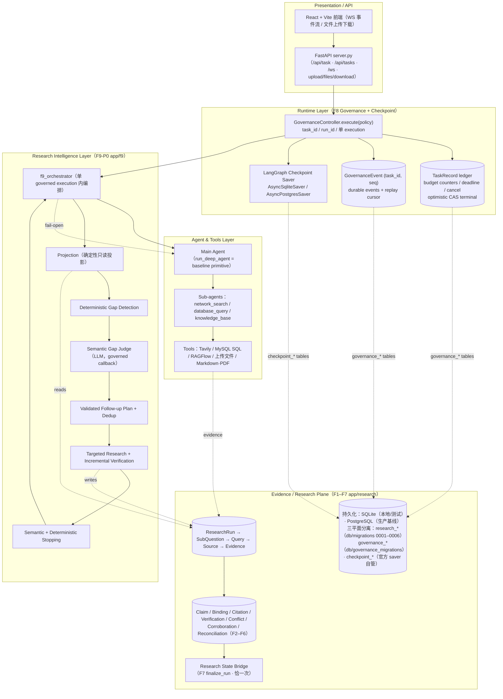

<div align='center'>
  <h1 style="margin-top: 15px;">「深度研搜」— Evidence-Grounded Multi-Agent Research System</h1>
  <h4><b>deepsearch-agents</b> · 多智能体深度研究系统</h4>
</div>

<div align='center'>


</div>

---

一句话定位：**把「LLM + Tools 的单轮问答」演进为「可治理、可验证、可追溯的
Evidence-Grounded Multi-Agent Research Runtime」**——用户给出一个研究任务，系统在受
治理的执行环境中完成多轮检索、证据沉淀、声明验证、冲突与独立性判断，并生成可追溯的
研究报告。

- 这不是一个"基于 LangChain 的 AI Agent 示例"，而是一套从 **Agent Runtime → Research
  Intelligence → Evidence Plane** 三个层面完整落地的研究系统。
- 本文档是**当前系统能力的展示层**，只描述已经实现并冻结的事实；开发过程记录见
  `docs/plan/`，架构/规范权威见 `docs/spec/` 与 `ARCHITECTURE.md`。

---

## 1. Project Overview

用户输入一个真实研究任务（例如：*结合公开资料、数据库信息和我上传的文档，整理一份
机器人行业研究报告并生成 PDF*）：

1. **前端**（React）把任务交给 **FastAPI 后端**（`POST /api/task`）；
2. **Runtime Governance（F8）** 为该任务创建持久的 TaskRecord，并以单一
   `Controller.execute(policy)` 管理整个生命周期（budget / deadline / cancel / terminal）；
3. **Supervisor / Main Agent**（DeepAgents 主智能体）负责任务理解、规划与路由；
4. **专家能力**分别负责三类信息源：网络搜索（Web / Tavily）、结构化数据（MySQL）、
   私有知识库（RAGFlow），加上上传文件的读取；
5. **Research Plane（F1–F7）** 把检索结果沉淀为可追溯的 Evidence / Claim / Citation /
   Verification / Conflict / Independence 事实层；
6. **Research Intelligence（F9-P0）** 在受治理的同一执行内做 evidence-driven 的
   adaptive research loop：发现缺口 → 判断缺口 → 制定 follow-up → 定向补搜 → 增量验证 →
   收敛停止；
7. 最终进入 **Final Synthesis → F7 finalize_run（恰一次）**，生成研究 Artifact
   （Markdown，可转 PDF）并推送给前端下载。

> 核心迁移：从 "Agent Tool Calling"（调用工具、拼接答案）演进为
> **"Research Runtime"**（执行受治理、证据可追溯、行为可评估、阈值经过校准）。

### 能力全景（当前已冻结）

```text
LLM Application（OpenAI 兼容模型）
        ↓
Agent Runtime（DeepAgents 一主三从 + 工具；run_deep_agent 为 baseline primitive）
        ↓
Runtime Governance（F8：task ledger / budget counters / deadline / cancel / durable events）
        ↓
Research Intelligence（F9-P0：Projection → Gap → Judge → Plan → Targeted Research → Verify → Stop）
        ↓
Evidence / Research Plane（F1–F7：Run → SubQuestion → Query → Source → Evidence → Claim →
        Citation → Verification → Conflict / Independence → Research State）
        ↓
Behavior Evaluation（deterministic eval harness）→ Calibration（阈值校准）
```

---

## 2. Why This Project Is Different

| 传统 LLM + Tools | 本系统（Evidence-Grounded Research Runtime） |
|---|---|
| User → LLM → Tools → Final Answer | User → Runtime Governance → Supervisor / Research Orchestrator → Evidence Collection → Claim / Citation → Verification → Conflict / Independence → Evidence-driven Follow-up → Finalization → Research Report |
| 单轮、无状态 | 完整 **execution lifecycle** + **durable state**（TaskRecord / research facts） |
| 无法约束资源 | **runtime budget**（agent steps / LLM calls / tool calls / search calls / wall-clock） |
| 无法中断 | **cancellation / timeout governance**（F8 terminal 权威） |
| 答案无出处 | **evidence provenance**（Source → Evidence → Citation 全程可追溯） |
| 声明无验证 | **claim / evidence binding** + **semantic verification**（F3 verdict 五态） |
| 矛盾被忽略 | **conflict detection**（F4） |
| 无法判断证据独立性 | **source independence / corroboration**（F5）→ reconciliation（F6） |
| 一次性检索、答案即终点 | **evidence-driven replan**：缺口判断 → 定向 follow-up → 增量验证 → 收敛停止 |
| 行为不可评估 | **behavioral evaluation**（deterministic harness + rubric） |
| 阈值拍脑袋 | **threshold calibration**（61 观测点实验 → 保留默认值） |

差异的本质：**多一层"事实与治理中间层"**。答案不是模型的即时输出，而是从可追溯的
证据状态出发、经验证与收敛后形成的研究产物；运行过程不是黑盒，而是受单一
governance execution 管辖、可取消、可超时、可查询的可观察链路。

---

## 3. Architecture

### 3.1 分层架构（当前真实结构）



职责边界（不可混淆）：

- **Runtime Layer**：`task_id` = lifecycle/durable 权威；`run_id` = F1 同源执行键。
- **Agent Layer**：Supervisor + 子智能体 + 工具，只负责"执行"。
- **Research Intelligence Layer**：只做编排与判断，**不新增第二 Runtime**；
  `research_round` 是 F9 编排计数，不注入 F8 BudgetCounter。
- **Evidence Plane**：事实与 artifact 的唯一落点，独立迁移、不与 Agent 主链路耦合。

### 3.2 三个平面的持久化纪律

| 平面 | 存储 | 说明 |
|---|---|---|
| checkpoint（agent 执行状态） | 官方 LangGraph saver（sqlite/postgres） | 仓库迁移禁止触碰 |
| F8 governance（TaskRecord / events） | `db/governance_migrations`（双后端） | TaskRecord = terminal truth；event = durable observation |
| research plane（F1–F7 artifacts） | `db/migrations 0001–0006`（双后端） | ResearchRun 作用域；≠ checkpoint，不共表/事务 |

> **PostgreSQL 是唯一生产基线与最终 Gate backend**；SQLite 仅用于快速测试/fallback。
> SQLite PASS ≠ PostgreSQL PASS。

---

## 4. Core Execution Flow

一次研究任务（受治理的单一 execution）的真实执行流：

```text
Round 0（broad research，复用 main agent / subagents / tools）
   → Research State Projection（确定性投影，无 LLM）
   → Deterministic Gap Detection（代码信号）
   → Semantic Gap Judgment（Judge：单次 LLM 调用，显式 governance callback 计费）
   → Validated Follow-up Plan（LLM 提议 → 确定性校验 + 去重）
   → Targeted Research（定向补搜）→ Incremental Re-verification（仅 changed claims）
   → Evaluate（足够 / 无进展 / 收益递减 / 预算临近）→ Continue / Stop
   → Final Synthesis（同一执行体内最后一次 agent 阶段）
   → F7 finalization（finalize_run 恰一次）
```

关键执行语义（已冻结）：

- **single execute**：整个 loop 只允许一次 `Controller.execute(policy)`；禁止 round 级
  嵌套 execute / 新 task / 新 run / 重置 counters。
- **baseline primitive**：`run_deep_agent` 是 baseline execution primitive / fallback
  实现；F9 unavailable（如 Judge 失败）时在同一 coroutine 内 fallback baseline，
  **不是第二条 submission path**。
- **adaptive path 与 fallback 共享同一治理上下文**（task_id / run_id / BudgetCounter /
  deadline / cancellation / terminal authority）。
- **F7 once**：仅 normal completion 执行 F7 finalize_run 恰一次；F8
  cancel/timeout/budget failure 路径**不执行 F7**。
- Judge failure 语义：fail-open = open to baseline，**不是 open to degraded adaptive
  intelligence**（同一 governed execution 内 fallback baseline research/synthesis）；
- Plan validation failure：fail-closed 拒绝非法 plan；无合法 plan 时同执行体内 fallback
  baseline；Verification failure 不伪造 verdict（claim → UNVERIFIABLE）。

---

## 5. Research Intelligence（F9-P0，按能力而非批次）

### Evidence State Projection
只读、确定性、无 LLM 的投影：从 research plane facts + orchestrator current_round 组装
结构化 JSON（run_id / round / budget / sub_questions / required_uncovered / claims /
best_verdict / independent_flag / fresh / conflicts / evidence_summary / gap_signals）。
只做 domain 计数、**不引入 authority**；null 字段禁止 LLM 补值。

### Gap Detection
先确定性信号（必答未覆盖 / claim 无 evidence / evidence < MIN_EVIDENCE /
INSUFFICIENT·UNVERIFIABLE / 未缓解 conflict / 独立源不足 / citation 不足 / 重复率高 /
预算临近），再交给语义判断。

### Semantic Gap Judgment
单次 Judge LLM 调用判断"是否足够 + 候选 follow-up"；经 governance callback 计入
`max_llm_calls`；失败 → 同一 governed execution 内 fallback baseline。

### Follow-up Planning
LLM 提议 → 确定性 validation（查重 / 上限 / 合法性）+ 去重：**query_identity ≠
dedup_identity**（后者 = query + objective + source_universe + time_window 的组合指纹）；
retry 不产生新 identity；re-verify 独立 namespace。

### Targeted Research
执行合法 plan 的定向补搜（复用 search tool），仅把新 Source/Evidence 增量写回 plane。

### Re-verification
新 evidence → binding → **仅 binding 变化的 claim 增量验证**（fingerprint 幂等）；
verification append-only 取最新 succeeded verdict；冲突集合变化才增量跑 F4–F6。

### Conflict / Independence Awareness
复用 F4（conflict detection）、F5（corroboration，只计 source independence、不评信任）、
F6（reconciliation：SAME_ORIGIN / DETAIL / GENUINE_CONTESTED；Unknown ≠ Not
Independent）——这些判断**只在证据集合真的变化时**增量执行，不重复全量扫描。

### Stopping Policy
- **Semantic Stop**：LLM recommendation（建议）。
- **Deterministic Policy（终裁）**：必答覆盖达标 AND 无未缓解 critical conflict AND
  claims 支持充分 → STOP；否则 FOLLOW-UP。
- 收敛守卫：max_research_rounds / no-progress / repeated-gap / diminishing-return，
  保证**不无限搜**。
- **budget 是 hard ceiling，不是 completion target**："还有预算"不得作为继续搜索的理由。

---

## 6. Evidence-Grounded Research（可追溯证据链）

```text
ResearchRun
  → SubQuestion（子问题拆解）
  → SearchQuery（含 query identity / 去重 / retry 语义）
  → Source（URL host 归一化 → domain 计数；不含 authority 判断）
  → Evidence（来源捕获；freshness 窗口）
  → Claim + Binding + Citation（F2：幂等绑定、校验规则）
  → Verification（F3：succeeded/failed，verdict 五态：SUPPORT / CONTRADICT /
       INSUFFICIENT / UNVERIFIABLE / null——排序键固定取最新 succeeded）
  → Conflict（F4）→ Corroboration（F5，独立性）→ Reconciliation（F6）
  → Research State（Projection 输入 / F9 编排依据）
```

- provenance：claim 绑定到 evidence，evidence 绑定到 source，source 绑定到 query/sub-
  question/run —— **任何最终结论都能反查到原始检索**。
- F7 Research State Bridge 是 finalization 唯一接线点：normal completion 时
  finalize_run 恰一次（fail-open，不阻塞主链路）。
- Eval/Projection 只读 query research plane（Registry / projection），不复制父对话历史、
  不 dump 冲突原文。

---

## 7. Runtime Governance（F8）

运行治理是"研究执行能被信任"的底座（实现范围，如实描述）：

- **Task lifecycle**：每任务一个 TaskRecord（task_id 主键），status = running + 8 个
  terminal 状态；`run_id` 与 F1 同源（governed 前绑定/回填）。
- **durable task ledger**：TaskRecord 持久化于 governance store（sqlite / postgres）。
- **单一 Controller.execute(policy)**：policy 含 `wall_clock_timeout / max_agent_steps /
  max_llm_calls / max_tool_calls / max_search_calls`。
- **runtime budget**：四类 hard counters（agent_step / llm_call / tool_call /
  search_call，search ⊆ tool），compare → increment → execute，**无 overshoot**。
- **wall-clock timeout / cancellation**：deadline 与 cancel 由 F8 统一裁决。
- **terminal 收敛**：memory 权威 + **optimistic CAS**
  （`WHERE status='running' AND version=?`）单 winner + retry ladder；GLE / cancel /
  timeout / budget 全部 funnel 到对应 terminal。
- **durable events**：GovernanceEvent `(task_id, seq)` + task-scoped replay cursor；
  `GET /api/threads/{thread_id}/events` 支持 catch-up 回放；WS 实时推送（live
  observation，fail-open，非 replay 权威）。
- **task/event query**：`GET /api/tasks`、`GET /api/tasks/{task_id}`。

明确不做（现状）：multi-instance governance / lease / heartbeat、分布式 scheduler、
startup 自动恢复（orphan reclaim 产品化）——均为文档化的 future，不做运行时承诺。

---

## 8. Evaluation（Behavioral Quality Validation）

不是"证明代码能运行"，而是验证 **Research Intelligence 是否真正改善了行为质量**。
采用**确定性 eval harness**（可复现、无真实 LLM 依赖）：

- **world**：确定性脚本化世界（query → evidence 路由），提供可控场景与公平起点；
- **agents**：ScriptedBaselineAgent 等确定性执行体；
- **dual execution**：baseline（`run_deep_agent`）vs adaptive（`f9_orchestrator`），
  各自独立 `Controller.execute`（独立 governance store / research DB / task / run），
  相同 benchmark task / 相同 F8 policy / 相同 world；
- **8 scenarios**（行为断言）：

| id | 场景 | 验证点 |
|---|---|---|
| s1 | already-sufficient | adaptive 不追加不必要 follow-up（plans == 0） |
| s2 | missing required | adaptive 定向补足 required coverage（0 → 1） |
| s3 | unverified claim | 增量 re-verification 驱动（changed claims） |
| s4 | conflict | F4 seam 兼容（preseed claim run） |
| s5 | insufficient corroboration | F5 seam 兼容、确定性 |
| s6 | diminishing / correct stopping | 正常收敛、F7 once |
| s7 | near-budget | cost compliance、counters ≤ limits |
| s8 | judge failure | same-execution fallback、F7 once、无第二 run |

- **rubric（8 维 0–1）**：required_coverage / citation_coverage / evidence_sufficiency /
  unsupported_score / conflict_coverage / redundant_score / cost_compliance + total；
  **verdict no-pad**：adaptive 需在 ≥1 grounding 维度 > baseline 且 total ≥ baseline
  才算 PASS（相等即 False），防止"为指标加搜"充收益。

结果：8/8 scenarios PASS；eval 测试 16/16 PASS。

---

## 9. Calibration（阈值校准，工程化决策）

Stopping 阈值不是拍脑袋，而是通过受控实验校准（复用 eval harness，不改生产默认值文件）：

- **5 个 stopping 参数** × 2–3 档 × 5 个代表场景（s1/s2/s6/s7/s8）= **61 个观测点**，
  每点独立 research db + governance（无跨点污染）；
- 覆盖方式：`MIN_EVIDENCE` / `BUDGET_NEAR_RATIO` 运行期 monkeypatch + policy 注入，
  **不改生产默认值文件**，每档结束恢复（测试断言恢复）；
- 观测指标：质量（rubric total/required/citation）、成本（counters ≤ limits）、
  stopping correctness（rounds / stopped / plans）；
- 结论（如实）：
  - 质量与成本对 5 参数**不敏感**；
  - 唯一可测影响 = `MIN_EVIDENCE` 对 stopping 轮次（1 → 2.6 / 2 → 3.0 / 3 → 3.4 轮）；
  - **最终推荐：维持现状默认值**（MIN_EVIDENCE=2, BUDGET_NEAR_RATIO=0.2,
    max_research_rounds=3, max_no_progress_rounds=1, repeated_gap_threshold=2）；
  - **production defaults unchanged**：无证据表明其他档严格更优 → 不改（禁止为 diff
    调参）。

---

## 10. Tech Stack（真实依赖）

| 模块 | 技术 | 用途 |
|---|---|---|
| 语言/运行 | Python 3.12（`uv` 管理） | 后端 |
| Agent 框架 | `DeepAgents 0.5.7` | 主智能体 + 子智能体组装 |
| 图运行时 | `LangGraph 1.1.10`（`langgraph-checkpoint-sqlite 3.0.3` / `langgraph-checkpoint-postgres 3.0.5`） | agent graph + checkpoint 双后端 |
| 模型/工具抽象 | `langchain 1.2.17` / `langchain-core` / `langchain-openai 1.2.1` | OpenAI 兼容模型、工具、调用结构 |
| LLM | OpenAI 兼容接口（`.env`：`OPENAI_BASE_URL` / `OPENAI_API_KEY` / `LLM_QWEN_MAX`） | 主链路 + Judge/Plan LLM |
| 后端 | `FastAPI` / `Uvicorn` / WebSocket | 任务、治理查询、上传下载、事件推送 |
| 数据库 | `PostgreSQL 16`（生产基线）+ `SQLite`（快速测试）；`psycopg 3` + `psycopg-pool` + `aiosqlite` | checkpoint / governance / research 三平面持久化 |
| Web 搜索 | `Tavily` | 网络搜索助手 |
| 结构化数据 | `MySQL`（docker 教学库）+ `mysql-connector-python` | 数据库查询助手 |
| 私有知识库 | `RAGFlow` + `ragflow-sdk` | 知识库助手 |
| 文件 | `pypdf` / `python-docx` / `pandas` / `openpyxl` / `reportlab` / `markdown` | 附件读取、Markdown 生成、PDF 转换 |
| 前端 | `React 19` + `antd 5` + `Tailwind 4` + `Vite` + `react-markdown` | 对话式研搜界面、事件流、文件管理 |
| 测试 | `pytest`（sqlite + PostgreSQL gate） | 全量回归 / 行为 eval / 校准 |

> 未使用（也不在 Roadmap 中引入）：Redis / Kafka / Neo4j / VectorDB / 分布式调度器 /
> multi-instance runtime。

---

## 11. Project Structure（真实目录）

```text
deepsearch-agents/
├── app/
│   ├── agent/                    # 主智能体 + 3 子智能体（network_search / database_query / knowledge_base）
│   │   ├── main_agent.py         # run_deep_agent 执行入口（baseline primitive）
│   │   ├── llm.py / prompts.py   # OpenAI 兼容模型初始化 / prompt 加载
│   ├── api/
│   │   ├── server.py             # FastAPI 任务 / 治理查询 / 上传下载 / WebSocket
│   │   ├── monitor.py            # live 事件推送（fail-open observation）
│   │   └── context.py            # thread_id / session_dir ContextVar
│   ├── runtime/
│   │   ├── checkpoint.py         # LangGraph checkpoint saver（sqlite/postgres 双后端）
│   │   └── governance/           # F8：controller / counters / callbacks / events / store / models / migrations
│   ├── research/                 # F1–F7 research plane：registry/store/schemas/provenance/
│   │                             #   verify(F3)/conflict(F4)/corroboration(F5)/reconciliation(F6)/bridge(F7)
│   ├── f9/                       # F9-P0 research intelligence：projection/gaps/judge/plan/
│   │   │                         #   targeted/orchestrator
│   │   └── eval/                 # 确定性 eval：world/agents/harness/rubric/scenarios/calibration
│   ├── tools/                    # Tavily / MySQL / RAGFlow / 文件读取 / Markdown / PDF
│   ├── ragflow/                  # RAGFlow 配置与示例
│   ├── prompt/prompts.yml        # 主智能体与子智能体提示词
│   └── utils/                    # path / session_id / sql_security / upload_guard / word_converter
├── db/
│   ├── migrations/               # research plane 迁移 0001–0006（sqlite + postgres 双方言）
│   └── governance_migrations/    # F8 governance 迁移（sqlite + postgres 双方言）
├── docs/
│   ├── spec/                     # 冻结规范（F1–F9 各阶段 Spec）
│   ├── plan/                     # 各批次 Plan / Readiness / Implementation Report / Final Completion Report
│   ├── images/ knowledge_base/ frontend/
├── frontend/                     # React + Vite 前端
├── tests/                        # pytest（含 governance / research / f9 / PG gate 测试族）
├── docker/                       # docker-compose（MySQL 教学库 + PostgreSQL）
├── examples/                     # DeepAgents 章节示例脚本
├── pyproject.toml / uv.lock      # 依赖声明与锁定
└── .env.example                  # 环境变量示例
```

---

## 12. Verification（当前真实证据）

> 数字以 F9-P0 Final Completion Report 与各 Implementation Report 为准；完整证据见
> `docs/plan/2026-10-01-f9-p0-final-completion-report.md` 与 `PROJECT_CONTEXT.md` §9。

| 项目 | 结果 |
|---|---|
| SQLite 全量回归 | **731 passed / 88 skipped / 0 failed**（排除既有 mysql 污染文件） |
| PostgreSQL gate | **81 passed / 0 failed**（14 个 postgres 测试文件，全量） |
| Eval（Batch7） | eval 测试 **16/16 PASS**；行为场景 **8/8 PASS** |
| Calibration（Batch8） | **61 观测点** → 维持现状默认值（无 production default 修改） |
| 静态检查 | `ruff` / `compileall`（app 与测试）全绿；`git diff --check` PASS |
| 兼容性 | 各批 **Compatibility Gap = None**（未触碰 F8 / F1–F7 / 已冻结 Batch 契约） |

诚实边界：

- Eval 为 **deterministic scripted world**；真实 provider（真实 LLM/search）E2E **未执行**
  （环境无有效凭据）——Gate 以确定性证据为准，**不伪造真实 provider 证据**；
- round state / follow-up plan 当前为 orchestrator 内 **in-memory**（无跨 execution
  持久化载体，见 §14）。

---

## 13. Current Status

```text
F9-P0 Core Implementation
STATUS: COMPLETE

Included:
- Batch1 Projection
- Batch2 Gap Detection
- Batch3 Judge
- Batch4 Planning / Dedup
- Batch5 Targeted Research + Verification
- Batch6 Adaptive Orchestrator
- Batch7 Deterministic Eval Harness
- Batch8 Stopping Threshold Calibration

Deferred:
- Research persistence
- Runtime recovery
- Real provider E2E
- Production hardening
```

- **Batch1–8 = FROZEN / MERGED**：B1–B6 归入 main 历史基线（`fdc0cdd`）；B7/B8 各自走
  feature-branch 生命周期后 MERGED → main（`619f6c7` / `be6d625`）；当前 `main` =
  frozen integration baseline（`be6d625`，本地=远程一致）；
- **Batch9 persistence / recovery = Deferred to P1**，不属于当前 F9-P0 实施范围；
- 当前阶段 = Documentation / Presentation（README / 面试材料收尾）。

---

## 14. Future Roadmap

只列**真正 deferred** 的项目（不在当前实现中）：

| 方向 | 说明 |
|---|---|
| **P1: Research persistence** | round state / query-identity ledger 持久化（research plane schema additive、零 ALTER 既有表；首版倾向 write-only audit + 只读查询） |
| **P1: Runtime recovery / resume** | 跨 execution 崩溃续算（F8 startup/sweeper 语义边界；不在 run 内建第二 task） |
| **P1: Production hardening** | sweeper / orphan reclaim 产品化、status-sync、server 级 superseded 接线、real-LLM verifier·extractor·judge 受控验证、`_govadapt` real-provider adapter |
| **Real-provider E2E** | 非 Gate；凭据环境就绪后作为确定性证据的 supplementary 佐证 |
| unresolved-gaps 最终答案可见性 | F7 边界 feature（Spec OQ4），独立裁决 |

> Roadmap 中的能力**尚未实现**；本 README 不把未来能力写成现状。

---

## 🚀 Quick Start

### 环境要求

- Python 3.12 + `uv`；Node.js + `pnpm`；Docker Compose；
- 可用大模型 API Key（OpenAI 兼容）+ Tavily API Key；可选 RAGFlow、PostgreSQL。

### 1. 克隆与安装

```bash
git clone https://github.com/AJiang4015/DeepScholar.git
cd DeepScholar
uv sync
```

### 2. 配置环境变量

```bash
cp .env.example .env
# 按本机服务修改：OPENAI_BASE_URL / OPENAI_API_KEY / LLM_QWEN_MAX
# TAVILY_API_KEY / RAGFLOW_API_URL / RAGFLOW_API_KEY / MYSQL_*
# 生产双后端（可选）：AGENT_CHECKPOINT_BACKEND=postgres + AGENT_CHECKPOINT_DSN / RESEARCH_DSN
```

### 3. 启动依赖与后端

```bash
docker compose -f docker/docker-compose.yaml up -d        # MySQL 教学库（可选）
docker compose -f docker/docker-compose.postgres.yaml up -d  # PostgreSQL（生产基线）
uv run uvicorn app.api.server:app --host 0.0.0.0 --port 8000 --reload
```

主要接口：

| 接口 | 说明 |
|---|---|
| `POST /api/task` | 启动一次受治理的研究任务（TaskRecord + Controller.execute(policy)） |
| `POST /api/task/{thread_id}/cancel` | 取消指定任务 |
| `GET /api/tasks` / `GET /api/tasks/{task_id}` | 任务/治理查询 |
| `GET /api/threads/{thread_id}/events` | durable events 回放 |
| `POST /api/upload` · `GET /api/files` · `GET /api/download` | 上传/列出/下载文件 |
| `WebSocket /ws/{thread_id}` | 工具调用、助手调用、结果与异常事件推送 |

### 4. 启动前端

```bash
cd frontend
pnpm install
pnpm dev
```

### 5. 试几个任务

```text
从数据库中查询心血管药品的库存情况，并生成 Markdown 报告。
搜索 2026 年 AI 在电商行业的应用趋势，并结合知识库资料生成一份 PDF。
请先读取我上传的行业报告，再结合公开资料整理一份研究摘要。
```

---

## 📚 文档导航

| 想看什么 | 去哪 |
|---|---|
| 当前状态 / 下一步 | `PROJECT_CONTEXT.md` |
| 行为契约 / 流程 | `AGENTS.md` / `PROCESS.md` |
| 架构边界与红线 | `ARCHITECTURE.md` |
| 冻结 Spec（F1–F9） | `docs/spec/` |
| F9-P0 最终完成报告 | `docs/plan/2026-10-01-f9-p0-final-completion-report.md` |
| 各批次实施报告 | `docs/plan/`（开发过程记录） |
| 问题注册 | `PROBLEM.md`（命中才读 `docs/problem/`） |
