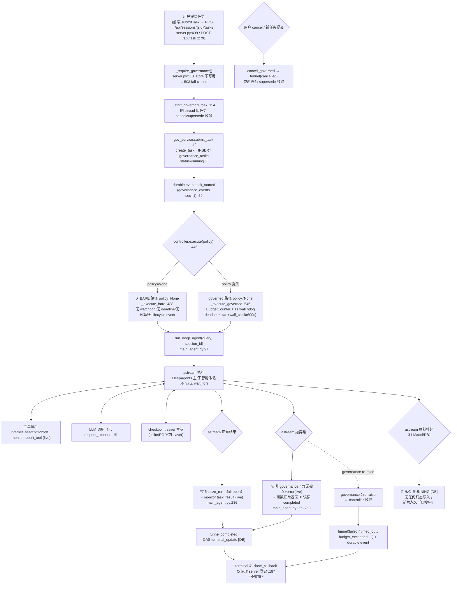

# RUNTIME_OBSERVABILITY_AUDIT_REPORT

深度研搜（DeepScholar / deepsearch-agents）Agent Runtime 可观测性与任务生命周期可靠性审计

- 审计日期：2026-10
- 审计范围：`app/` 后端 Runtime 层（server / session / governance / agent / monitor / research 接线）＋前端状态恢复语义
- 审计级别：**L0 Read-only / Analysis**（只读 + 方案设计，**未修改任何代码**）
- 关联现场：任务 `ea11212a`（截断展示为 8 位；完整 task_id = uuid4().hex 32 位）、会话 `c345e0c6308e4bbaa1461567f20b16d6`，04:23–04:26 正常产生工具事件后永久停留「研搜中」>30 分钟，无终态、无失败、无异常日志、无状态变化日志。
- 审计基线：`main` @ `af7eb02`（multi-session frontend 合并后 HEAD，本地=远程一致；工作树另有简历相关未提交文档，与本审计无关）。
- 结论一句话：**Task 终态只有在「底层 coroutine 返回/抛异常」或「governed 模式下的 watchdog/budget/cancel」时才会被收敛；而当前前端 + API 默认路径（policy=None）走的是无 deadline、无 watchdog、无 heartbeat 的 bare 路径——一旦 LLM 调用 / tool 调用 / checkpoint 写盘静默挂起，TaskRecord 将永久停留 RUNNING，这正是现场现象的充分条件。且不存在任何持久化 heartbeat / agent-step 事件 / 会话 transcript，事后无法诊断与还原时间线。**

---

## 0. 证据清单（读了什么、为什么读）

| 文件 | 关键结论 |
|---|---|
| `app/api/server.py` | 唯一 HTTP/WS 入口；任务提交走 governed `submit_task`；**`TaskRequest.policy` 缺省 None 且不补默认值**（L145-147、L279-303）；cancel/supersede/事件 replay 端点 |
| `app/runtime/governance/service.py` | `submit_task`：建 TaskRecord(running) → 写 `task_started` durable event → `asyncio.create_task(controller.execute(..., policy=policy))`；**policy=None 时无默认 policy 注入**（L42-72） |
| `app/runtime/governance/controller.py` | Task 生命周期唯一写者：`terminalize` funnel（内存裁决+乐观 CAS）／`execute()`：**policy=None → `_execute_bare`（无 watchdog、无 deadline、无预算、无 lifecycle event）；policy 给定 → `_execute_governed`（BudgetCounter + watchdog + event）**（L445-681） |
| `app/runtime/governance/models.py` | `TaskStatus`：running + 8 终态；**无 queued/STALE**（L15-40） |
| `app/runtime/governance/events.py` | durable event 单写者、`(task_id,seq)` 全序、白名单仅 lifecycle 类型（L29-39）；replay 端点读 |
| `app/runtime/governance/store.py` / `db/governance_migrations/0001…sql` | `governance_tasks` / `governance_events` schema：**无 heartbeat / last_seen 列** |
| `app/runtime/governance/callbacks.py` + `counters.py` + `context.py` | governed 模式预算与 callback 注入契约；仅 `_execute_governed` 内生效 |
| `app/agent/main_agent.py` | `run_deep_agent`：**异常吞掉语义（非 governance 模式）**；finally 只 reset ContextVar，不保证 Task 终态（L254-275）；astream 无 `asyncio.wait_for` |
| `app/agent/llm.py` | `init_chat_model(...)` **未配置 request_timeout**；provider 层 hang 无守卫 |
| `app/api/monitor.py` | monitor event envelope（live，WS 定向，**进程内 seq，不持久化**）；fail-open |
| `app/api/context.py` / `app/session/*` | thread_id/session 上下文；session 仅 ACTIVE/ARCHIVED 两态；**默认标题 `未命名会话`，无自动标题生成**（service.py L25、L98） |
| `app/tools/*` | 工具事件（tool_start）只在调用时刻 live 上报；工具失败以返回字符串呈现 |
| `frontend/src/hooks/useDeepAgentSession.ts` | **前端从不发送 policy**；durable 终态校正依赖 `GET /api/tasks/{id}`；「研搜中」＝ UI 对 `running` 的展示（L6 taskStatus.ts） |
| `frontend/src/components/SessionWorkspace.tsx` / `App.tsx` | 刷新后按 durable `latest_task.status=running` 恢复运行态 → **若 DB 永久 running 则永久「研搜中」**；turns 仅浏览器内存缓存，无 durable transcript |
| `docs/plan/2026-10-03-multi-session-*` | 标题不可改 / 默认「未命名会话」为已记录取舍；title 自动派生推迟（backend 后续 additive） |
| `docs/spec/2026-09-14…`、`2026-09-15…`、`2026-09-17…`、PROJECT_CONTEXT §8 | F8 冻结：single-instance 无 lease/heartbeat；sweeper/orphan reclaim/startup recovery **文档化的 future（未实现）**；policy 缺省语义、event 边界 |
| `tests/`（test_runtime_governance_*.py 等） | watchdog/budget/funnel 语义均有测试锁定；但全部面向「显式传入 policy」的 governed 路径 |

---

## 1. 当前 Runtime 流程图（含状态保存位置 / 异常处理位置 / 状态丢失风险点）

> 图注约定：`[DB]`=持久化状态；`(live)`=仅 WS 实时、易失；`※`=异常处理点；`✗`=状态丢失/失控风险点。



### 1.1 逐段注解（状态保存 / 异常处理 / 丢失风险）

| # | 阶段 | 状态保存位置 | 异常处理位置 | 状态丢失/失控风险点 |
|---|---|---|---|---|
| 1 | 用户请求→Session/Task 创建 | `governance_tasks` 行（INSERT running）；`sessions` 行 | `_require_governance` 503 fail-closed | 任务先于任何执行存在；若后续永不终态化则永远 running |
| 2 | 调度执行 | controller `_handles`（进程内）＋ TaskRecord | `controller.execute` 异常映射 | `active_tasks`/`_task_registry` 仅内存；**进程重启后登记丢失** |
| 3 | bare 路径（policy=None，前端实际路径） | 仅 started_at | `_execute_bare` 只在「await 返回/抛异常」时收敛 | **✗ 无 watchdog：静默挂起 ⇒ RUNNING 永久**（现场直接原因） |
| 4 | governed 路径 | counters/decision 内存 + DB | watchdog/budget/cancel/异常 全收敛 | 依赖调用方显式传 policy；**无人传 ⇒ 永不走本路径** |
| 5 | run_deep_agent 执行 | run_id/thread ContextVar；research artifacts（旁路 fail-open） | `except Exception`（非 governance **吞掉**） | **✗ 异常被吞并误标 completed**；finally 只 reset 上下文，**不保证 Task 终态** |
| 6 | LLM 调用 | 无 | 无（无 request_timeout / wait_for） | **✗ LLM 静默 hang = 现场「不再产生调用」的最可能卡点** |
| 7 | Tool 调用 | 无（仅 live tool_start） | 工具内部 try/except 返回字符串；tool 层真异常→astream 异常 | sync tool 在 executor 线程卡死时仅 governed watchdog 可 cancel 等待（linger）；bare 无解 |
| 8 | checkpoint 写盘 | langgraph checkpoint_* 表 | 无 | PG/sqlite 写盘阻塞/死锁可 hang 整个 astream |
| 9 | monitor live 事件 | **无持久化**（WS per-thread 队列） | fail-open | **✗ 断线/刷新即丢**；只有最近 120 条进前端内存 |
| 10 | 终态收敛 | `governance_tasks` CAS terminal_update | funnel（内存裁决+重试→pending） | **✗ pending_terminal 无生产 flush 调用方**（`flush_pending` 无 caller）；DB 写失败时 DB 行可永久 running |
| 11 | 终态事件 | governance_events（仅 governed finalize_with_event 写 terminal 事件；bare **不写**） | fail-open | bare 终态无 terminal event → 事件时间线只有 task_started |
| 12 | 前端「研搜中」 | 依据 durable `latest_task.status` + live 事件 | reconcile 上限 20 次×250ms | **✗ 若 DB 永久 running ⇒ 前端永久「研搜中」**（与现场 30+ 分钟无终态现象一致） |

---

## 2. Task 生命周期分析

### 2.1 当前状态集合（`app/runtime/governance/models.py:15-40`，冻结于 F8）

| 状态 | 语义 | 备注 |
|---|---|---|
| `running` | 唯一非终态 | 无 queued / **无 STALE / PENDING** |
| `completed` `failed` `cancelled` `timed_out` `budget_exceeded` `superseded` `aborted` `orphan_reclaimed` | 8 个终态 | `orphan_reclaimed` **从未被任何生产路径产出**（sweeper 未实现） |

### 2.2 状态转换在哪里发生（唯一写者 = GovernanceController）

- `running` 建立：`controller.create_task()`（`controller.py:195-221`）→ `gov_store.insert_task()`（`store.py:233`）。
- `started_at`：`gov_store.start_task()`（`store.py:293`）。
- 终态收敛（**唯一入口**）：`controller.terminalize()`（`controller.py:245-326`）→ 内存裁决 → `_cancel_underlying` → `gov_store.terminal_update()` 乐观 CAS（`WHERE status='running' AND version=?`，`store.py:315-356`）。
- 终态触发方：`_execute_bare` / `_execute_governed` 正常/异常分支、`_watchdog_loop`（timed_out）、cancel API、supersede 收敛、c2 控制故障收敛。
- 注意：`server` 层从不直接写 TaskRecord（只经 controller/service），前端只读。**单写者纪律成立。**

### 2.3 关键问题回答

**Q：RUNNING 如何退出？**
只有 4 类事件能让 coroutine 结束从而触发 funnel：
1. astream 正常返回 → `completed`；
2. astream 抛异常 → `failed`（governed 才可靠：bare 下被 `run_deep_agent` 吞掉 → 误标 completed，见 §3）；
3. governed 路径 watchdog 到 deadline → `timed_out`；预算超限 → `budget_exceeded`；GraphRecursionError → `failed(framework_recursion_safety)`；
4. 用户 cancel / 同 thread 新任务 supersede → `cancelled` / `superseded`。

**不存在第 5 类**：无 heartbeat、无「无进展即 stale」、无启动期 orphan reclaim、无进程外守护。**`flush_pending`（pending_terminal 兜底）在 app 生产代码中无任何调用方**（仅测试调用），其注释自称的「reconciler(15s) / shutdown flush / startup 兜底」均未接线。

**Q：是否存在非法状态停留？**
存在，且就是现场形态：
- **RUNNING 永久停留**：静默挂起（LLM/tool/checkpoint）＋ 非 governed 路径 ⇒ 无 deadline ⇒ 永久 running。**前端策略已假定 durable running 即真 running**，刷新后照样「研搜中」。
- **进程重启后遗留 running**：TaskRecord 无 lease/heartbeat；启动不扫描；旧行永远 running（现场若后端被重启过即命中）。
- **内存已终态、DB 仍 running**：terminal 乐观写 3 次失败 → `pending=True`；无生产 flush → DB 永久 running（降级场景）。
- **错误终态**：bare 模式下 agent 异常被 `run_deep_agent` 吞掉后**正常返回 → funnel(completed)**，即「实际失败被记为成功」（`main_agent.py:259-268` + `_execute_bare` else 分支）。

**Q：heartbeat / watchdog / execution timeout / runtime event tracking 现状？**
| 能力 | 现状 | 证据 |
|---|---|---|
| heartbeat | **无**（服务端）。前端 WS ping(25s) 只是传输层心跳，不反映任务存活 | `useDeepAgentSession.ts:184-189`；全 app 无 heartbeat 写 |
| watchdog | **仅 governed 路径**（policy 提供），1s tick，单调 deadline | `controller.py:683-716`；`WATCHDOG_TICK_SECONDS=1.0` |
| execution timeout | 仅 `wall_clock_timeout`（policy key，默认 600s）；**policy=None ⇒ 无超时** | `controller.py:584-586`、`_execute_bare` |
| runtime event tracking | 生命周期事件 durable（governance_events）；agent/tool/llm 进度事件**仅 live** | `events.py:29-39`；`monitor.py`（无持久化） |

> **文档-代码漂移确认**：`server.py:145-147` 注释声明 policy「缺省由 governance 服务默认（M-Spec §7.4）」，但 `gov_service.submit_task` 与 `controller.execute` 均未在 policy=None 时注入默认值，实际落入 `_execute_bare`。`docs/plan/2026-10-03-multi-session-backend-architecture-analysis-and-plan.md` 亦把「title 默认/query enrich」标为后续项，与现状一致。

---

## 3. Agent 生命周期分析（Agent 执行进程 vs Task 状态）

### 3.1 入口

```
server POST /api/sessions/{sid}/tasks        （server.py:438）
  → _start_governed_task（收敛旧任务后）      （server.py:194）
  → gov_service.submit_task                    （service.py:42）
      create_task(running) → lifecycle_event(task_started)
  → asyncio.create_task(controller.execute(task_id, run_deep_agent(query, sid), policy))
  → run_deep_agent                             （main_agent.py:97）
      session_dir / uploads / ContextVar / research run(fail-open)
  → get_main_agent()（lazy 组装 DeepAgents）   （main_agent.py:66-90）
  → agent.astream(...)                         （main_agent.py:202）
```

### 3.2 结束（正常）

astream 正常结束 → F7 `bridge.finalize_run`（fail-open、恰一次，`main_agent.py:236-252`）→ `monitor.task_result`（live、恰一次，`RunTerminalGuard`）→ 函数返回 → controller funnel `completed`（governed 同时发 durable `task_completed`；bare 只写 DB 不发事件）。

### 3.3 结束（异常 / 取消）

| 场景 | 谁处理 | 行为 | 问题 |
|---|---|---|---|
| astream 抛异常 | `run_deep_agent` `except Exception`（L259-268） | 非 governance：report_error(live) + **吞掉**→正常返回；governance：re-raise → controller funnel failed | **bare 误标 completed；live error 不持久化** |
| CancelledError | L254-258 + controller | report_task_cancelled + re-raise；controller 不伪造终态 | 若 funnel 尚未裁决而外部直接 cancel 任务（如进程关停），DB 无终态 |
| Tool 调用失败 | 工具自身 try/except 返回错误字符串（md/pdf 工具如此）；真异常上抛到框架 | 前端看到的是字符串而非结构化失败 | 无 `tool_end/tool_error` 事件；governance callback 只在 `on_tool_start` 计数，**不计 tool 失败语义** |
| LLM 调用失败/超时 | 无 | provider 层默认超时行为（本项目 `init_chat_model` 未配置 `request_timeout`） | 慢响应可静默长等；无 per-call 超时 |
| LLM/工具/tool/checkpoint **静默挂起** | **无任何代码路径** | — | **RUNNING 永久（现场根因通道）** |
| 用户 cancel | `controller.cancel_governed` → funnel(cancelled) | sync tool 继续跑完（linger 观察字段） | cancel 后 DB=terminal 但底层线程 linger（文档化，可接受） |

### 3.4 finally / 失败回调

- `run_deep_agent` 的 `finally`（L269-275）**只做 ContextVar reset**，不 funnel、不更新任何 Task/run 状态。
- `controller._execute_bare/_governed` 的 `finally`（L529-531 / L675-681）只移除 handle、取消 watchdog。
- server 的 `done_callback`（`server.py:227-229` / `_forget_governed_task`）**只清理登记**，不做失败回调、不校验「task 是否终态」。
- **结论：不存在任何「执行退出 ⇒ Task 必达终态」的 guarantee**。终态完全依赖「执行自身正常返回/抛异常」或「governed watchdog/cancel」。

### 3.5 结论（Q：Task 状态是否与 Agent 执行生命周期绑定？）

**弱绑定**：TaskRecord 的写入点是「执行开始前（running）」与「执行结束后（terminal funnel）」，**执行期间不存在任何续命/存活信号**；Task 状态机与 Agent 执行是「两头钩、中间断」——中间任何不可观察的停顿都表现为「running 且无任何进展记录」。这正是需要 Phase-2 heartbeat + step event 填充的断层。

---

## 4. Event / Log / Trace 能力分析

### 4.1 现状盘点

| 能力 | 现状 | 载体 | 持久化 | 可回放 |
|---|---|---|---|---|
| task event | 有（仅 lifecycle：task_started/…_terminal） | `governance_events`，`(task_id,seq)` 全序单写者 | ✅ | ✅ `GET /api/threads/{tid}/events`、WS since_seq |
| agent event（tool/llm/step/assistant） | 有但 **live-only** | monitor envelope（event_id/run_id/thread_id/task_id/seq） | ❌ | ❌（断线/刷新即失） |
| execution record | **无**（无 per-step/agent 执行表） | — | — | — |
| trace id | 部分（thread_id / task_id / run_id / monitor event_id 可关联；monitor seq 进程内全序） | 信封字段 | monitor 部分 ❌ | monitor 无 |
| heartbeat | **无** | — | — | — |
| conversation transcript | **无**（对话 turns 只在浏览器内存 `turnsBySession`；刷新即空，靠 durable task 摘要 + live 事件重建） | 无表 | ❌ | ❌ |
| 结构化日志 | **无**（print 保底；uvicorn access log；`list_files` 里每次轮询打 `[DEBUG] 请求文件列表` —— 与现场「只有 GET /api/files 日志」一致） | stdout | ❌ | — |

### 4.2 现场可解释性核对

- 「04:23–04:26 工具事件正常」：`internet_search` 每次调用都 `monitor.report_tool`（live WS），前端可显示。
- 「之后 LLM 不再产生调用、无输出、无终态」：主智能体下一轮决策 LLM 调用开始后静默挂起（或工具/saver 阻塞），astream 永不返回 → funnel 永不触发；无 watchdog（policy=None）→ TaskRecord 永久 running → 前端「研搜中」。
- 「后端只有 GET /api/files」：前端每 2.5s/6s 轮询文件列表（`useDeepAgentSession.ts:306-322`），`server.py:654` print 刷屏；其余执行路径在挂起后不产生任何日志。
- 「刷新后无法恢复 Timeline」：tool/assistant 事件不持久化；durable replay 只有 task_started；会话 turns 无 transcript → UI 只能显示「running 摘要 + 空过程」。

### 4.3 最小实现方案（设计；未实施）

1. **durable agent event（最小）**：复用 `governance_events` 表与单写者/sequencer，把 monitor 的 `tool_start/assistant_call/task_started…` 关键事件经同一写者落库（新增 event_type 白名单扩展，不改 schema）；代价低、立即获得「刷新后可回放的时间线骨架」。风险：写库延迟/失败必须 fail-open（沿用 observation 纪律）。
2. **execution step 明细（进阶级）**：若需要 llm/step 级明细（admin 诊断用），新增独立 append-only 表（见 §5.3 agent_execution），由 controller/callback 异步批量写，不进 agent 主链路。
3. **conversation transcript（历史恢复必需）**：新增 turns 表，任务终态时由 runtime 落一行（query/result/error/status/文件清单/时间），前端刷新后据此重建对话（取代「未命名 + 只有 task 摘要」）。

---

## 5. Phase-2 Runtime Reliability 方案（设计稿，等待确认后实施）

### 5.0 设计目标（对应「必须支持」4 项）

1. **任务不会永久 RUNNING**：任何 task 在 `last_heartbeat` 超过阈值后进入可观测 stale 状态，并被收敛为终态（timed_out/orphan_reclaimed），绝不以 running 裸奔；
2. **任务历史恢复**：刷新后按 durable 数据重建 Timeline（task 创建→agent 调度→tool→LLM→终态原因），不再空显示「研搜中」；
3. **后台可诊断**：管理员/开发者能回答「当前运行任务、当前 Agent/Step、最近事件、最后 heartbeat、错误原因」；
4. **会话标题生成**：首次用户请求后自动生成 conversation title，替代「未命名会话」。

### 5.1 总体原则（对仓库约束的映射）

| 用户约束 | 落实方式 |
|---|---|
| 不修改现有 Agent 业务逻辑 | 所有改动落在 runtime 层（controller/service/monitor/execution_store）与「提交默认 policy」接线；`run_deep_agent` 的 agent 组装、prompt、topology、工具签名不动 |
| 不增加新的 Research 能力 | 不触碰 research plane / orchestrator / F1–F7 / F9 |
| 优先 Runtime 可靠性 | 新增模块全部位于 `app/runtime/` 域 |
| 兼容 F8 冻结契约 | TaskStatus/terminal funnel/CAS/event replay 语义不改；新增能力走 additive（新列/新表/新端点/新 event_type）；「STALE 中间态」以派生视图呈现，不新增 TaskStatus 枚举值（避免改冻结 enum，详见 §5.4 A/B 决策点） |

### 5.2 新增文件（提案）

```
app/runtime/
    lifecycle.py        # Task 生命周期规则：默认 policy、启动 orphan reclaim、stale→终态收敛编排
    event_bus.py        # durable runtime event 写者/批量 flush/单写者封装（扩展现有 events.py 白名单，不重复造 sequencer）
    heartbeat.py        # 执行心跳：beat() 写入点 + last_heartbeat 状态（内存+DB 轻量列）
    watchdog.py         # 执行期 watchdog 泛化：wall-clock + 无进展(no-progress)双守卫（复用 controller._watchdog_loop 语义，抽到独立模块供 governed/always-on 复用）
    execution_store.py  # agent execution / step / conversation turn 的 store 层（函数式 repository，复用 governance store 连接与事务纪律）
```

### 5.3 数据库（映射表；全部 additive migration 0003/0004）

| 逻辑域（用户要求） | 落地表 | 说明 |
|---|---|---|
| `task` | `governance_tasks`（既有） | **additive 列**：`last_heartbeat_at`、`last_event_at`（`0003` migration；不动既有列/索引） |
| `task_events` | `governance_events`（既有，可视为 task 事件账本） | 扩展 `event_type` 白名单：`task_step/tool_call/llm_call/assistant_call/heartbeat_stall…`；沿用 `(task_id,seq)` 全序 + PK 幂等 |
| `agent_execution` | 新表 `agent_execution`（0004） | 每次 run 一行（`execution_id/task_id/run_id/thread_id/owner/started_at/finished_at/status/error/step_count/last_heartbeat_at`）；rich step 可另存 `execution_steps`（无则省略） |
| `conversation` | 新表 `conversation_turns`（0004） | `turn_id/session_id(=thread_id)/task_id/run_id/role/query/result/error/status/files_json/created_at/finished_at`；session 一换一对话，按 session 重建 |

> 取舍：不建独立 task/task_events 影子表，避免与既有 governance 双账本漂移（与仓库「三平面不混淆」纪律一致）。

### 5.4 关键机制设计

**A. 默认 policy 强制化（根因修复 #1 —— 不做则下面全部白搭）**
- `gov_service.submit_task`：`policy=None` 时注入 `DEFAULT_GOVERNED_POLICY`（wall_clock_timeout=600s、max_agent_steps=200、max_llm_calls=120、max_tool_calls=300、max_search_calls=40，与 M-Spec §7.4 一致），保证**每条任务都走 `_execute_governed`**（watchdog 常开、异常 re-raise、terminal event 常发）。
- 同时补 `TaskRequest` 服务端钳制：policy 显式值不得低于下限（服务端 still 可钳制，与 `server.py:145-147` 注释的「后续 API Step」对齐）。
- 影响面：server/前端不传 policy 的现有调用**行为变化**为「受治理执行」——正是设计意图；需回归 `test_runtime_governance_controller.py` 中 policy=None 语义用例（Step2 冻结语义将被正式替换为 governed-缺省，属**契约变更**，须用户批准 + Decision 记录）。

**B. heartbeat + stale 判定（根因修复 #2）**
- 写点：`controller._execute_governed` 内 watchdog tick 顺带写 `last_heartbeat_at`（1s 量级，DB 写节流如 ≥5s 一次，避免写放大）；可选：astream chunk 循环内由 runtime hook 打轻量 in-memory beat（DB 节流）。
- 判定：后台心跳扫描器（或独立 asyncio task，30s 周期，仅 single-instance 安全）——
  `running` 且 `now - last_heartbeat_at > STALE_THRESHOLD(=wall_clock+30s 或固定 10min 可配)` → 标记 stale 视图 → 调 `terminalize(ORPHAN_RECLAIMED)`（复用既有终态，**不新增 STALE 枚举**；stale 作为 API/前端派生展示态，如 `"stale": true`）。
- **启动 reclaim**：lifespan 启动后扫描 `running` 行（single-instance 假设成立：本进程崩溃遗留）→ owner 非本进程或 last_heartbeat 超阈 → reclaim 为 `orphan_reclaimed`（F8 语义「startup sweep」，PROJECT_CONTEXT §8 已列为 future，本轮实现产品化）。

**C. 事件/执行记录（可观测性 #2/#3）**
- `event_bus.py`：monitor 关键 live 事件经事件总线异步落 `governance_events`（扩展 event_type）；写失败 fail-open（observation 纪律）。批量 flush（如每 1s 或 100 条）避免每事件一次事务。
- `execution_store.py`：run 起止行 + 终态时写 `conversation_turns`；step 明细（可选）写 `agent_execution`/steps。
- 管理面：`GET /api/admin/runtime`（运行中 task 列表：task/run/owner/last_heartbeat/last_event/当前 step 计数/error）——纯只读，与 P005「无鉴权」边界一致（教学环境，README 声明）。

**D. 会话标题自动生成（需求 #4）**
- 触发：`POST /api/sessions/{sid}/tasks` 提交成功且 session.title 仍为默认「未命名会话」时，异步（不阻塞任务、不进 governed budget）生成标题并 `UPDATE sessions SET title=?`。
- 生成：**优先规则化、低成本确定性方案**——从 query 提取（去提示词尾缀、截断 ≤50 字、去除「请/分析/并/输出/生成」等外壳后可保留核心实体+动作）。需要更像示例「奔驰集团近五年股票走势分析」→ 可选方案 B：一次轻量 LLM 摘要（在 governance ContextVar **之外**调用独立 chat completion，预算不计入 hard counter；失败 fallback 到确定性截断，fail-open）。
- 契约：仅当标题==默认值才覆盖（用户未来 rename 后不覆盖）；`updated_at` 刷新；UI 侧列表刷新即生效（既有 `GET /api/sessions` 消费）。

**E. 前端最小配合**
- 刷新恢复：优先用 `conversation_turns` 重建对话 + `governance_events/agent_execution` 重建时间线；仅当 durable running 且 heartbeat 新鲜才显示运行态；stale/terminal 一律落到终态文案（不再无限「研搜中」）。
- 轮询可叠加 `GET /api/admin/runtime?thread=…`（可选）。

### 5.5 与既有冻结契约的兼容矩阵（实施前必须用户确认的变更点）

| 变更 | 冻结面 | 是否触碰 | 处理 |
|---|---|---|---|
| 默认 policy 注入（policy=None → governed） | Step2「execute 不传 policy = bare」语义（docs/spec/…step3 §7） | **是（行为契约变更）** | 需用户批准 + Decision + 更新冻结 spec 记录；回归受影响测试 |
| governance_tasks 加列（heartbeat） | schema/migration 纪律（additive 允许） | additive | 0003 migration；不动既有列/CAS |
| governance_events 扩展 event_type | 单写者/(task_id,seq)/PK 幂等纪律保持 | additive | 不破坏 replay cursor |
| 新增 agent_execution / conversation_turns | 无既有表 | 新表 | 0004 migration |
| 新增 runtime/ 模块 | F8 controller 内部实现抽 watchdog 到模块（行为等价） | 重构边界需评审 | 先复用再抽取，diff 最小 |
| TaskStatus 增 STALE | F8 models enum 冻结 | **否（采用派生 stale）** | 若用户坚持原生 STALE 态 → 单独 L3 Decision |
| 新增 admin 端点 | 无鉴权（P005 Won't Fix） | additive | 声明教学边界 |

### 5.6 建议实施批次（确认后按批推进、每批独立验证）

1. **P2-1（根因修复，最高优先）**：默认 policy 强制化 + watchdog always-on + 启动 reclaim —— 直接消灭「永久 RUNNING」；
2. **P2-2（存活信号）**：heartbeat 列 + stale 扫描 + `orphan_reclaimed` 收敛 + 恢复「最后 heartbeat/最后事件」到任务详情 API；
3. **P2-3（历史时间线）**：event_bus 落库 monitor 关键事件 + conversation_turns + 刷新恢复 UI；
4. **P2-4（后台诊断）**：`/api/admin/runtime` + execution store run/step 行；
5. **P2-5（会话标题）**：自动标题生成（确定性 + 可选 LLM fallback）。

每批验收锚点（示例）：
- P2-1：注入假 LLM 挂起（测试替身 sleep 超长）→ 600s（或测试缩时）内 TaskRecord 必达 `timed_out`；重启后遗留 running 行被 reclaim。
- P2-2：运行中 task 的 `last_heartbeat_at` 单调更新；模拟停 beat → 阈值后 → `orphan_reclaimed`。
- P2-3：刷新页面后仍可看到 tool/assistant 时间线 + 对话内容。
- P2-4：admin 接口可列出「运行任务 + 最后 heartbeat + 最后事件 + error」。
- P2-5：新会话首条任务后标题变为语义摘要，非「未命名会话」。

### 5.7 验证与测试（不新增 Agent 能力，只测 runtime）

- 单元：heartbeat 写节流、stale 判定边界、reclaim CAS 幂等、event_bus 批量 flush 与 fail-open、默认 policy 注入（bare 路径消除）。
- 集成：policy=None 提交 → 确认走 governed（decision：watchdog 生效）；假挂起替身 → timed_out；cancel 竞态；重启遗留行 reclaim。
- 回归：既有 governance/session/orchestrator 全套（sqlite + PG 双 DSN），确保 funnel/CAS/event replay 语义零回归。

---

## 6. 结论与建议

1. **现场根因（高置信）**：任务经 API 提交时 policy=None → `controller.execute` 走 `_execute_bare`（无 watchdog/无 deadline）→ 执行（LLM/tool/checkpoint 任意环节）静默挂起 → coroutine 永不返回 → TaskRecord 永久 `running` → 前端按 durable running 永久显示「研搜中」。可复现且与全部日志/时间线现象吻合。
2. **结构性缺口**：Task 状态与 Agent 执行生命周期**弱绑定**（起止两钩、中间无心跳）；不存在任何「执行退出必达终态」的 guarantee；monitor 事件不持久化；无会话 transcript；无默认 policy 治理；无启动/周期 reclaim；异常在非 governance 模式被吞并误标 completed；`flush_pending` 无生产调用。
3. **Phase-2 可行且不与冻结 Agent 业务冲突**：全部落在 runtime 层（§5），最小必要契约变更是「policy=None 默认受治理」与 schema additive 迁移，均需用户显式批准后实施。
4. **本审计为 L0 产物**：未修改任何代码；按仓库纪律，实施前需单独进入 feature branch（如 `feature/runtime-phase2-reliability`）并按 L3 流程（Readiness → Decision → Plan → 分批实现 → 验证 → Freeze → Merge）推进。

## 7. 待用户裁决事项

1. 是否批准按 §5 Phase-2 方案实施？若批准，是否按 P2-1…P2-5 分批推进？
2. 是否接受「policy=None ⇒ 默认 governed（含 600s wall clock）」这一契约变更（§5.4-A / 5.5）？
3. stale 呈现方式：派生视图（推荐，不动冻结 TaskStatus enum）还是新增原生 `STALE` 状态（需改冻结 enum，L3 决策）？
4. 会话标题生成：确定性规则（推荐先做）还是叠加轻量 LLM 摘要（方案 B）？
5. 「任务不会永久 RUNNING」的阈值默认值：wall_clock 600s 沿用 M-Spec 默认？stale 阈值建议 wall_clock+30s 或独立可配？

---

*附：本报告证据均来自审计基线 `main @ af7eb02` 实际代码（路径+行号如文中标注）；报告本身为只读分析产物，符合 PROCESS.md §11.1 L0 与 AGENTS.md §10.2（Readiness/audit 产物不承载实现提交）。*
